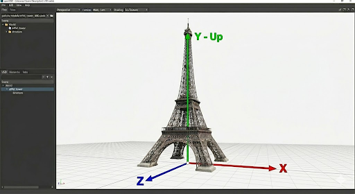

# Geospatial Coordinate Reference Systems for OpenUSD

**Local review candidate.** This revision proposes a complete initial-scope
contract for author review. It retains the October 2 scope and reference-based
binding decisions, and separates authored geospatial inputs from computed
results. The field, working-frame, measurement, Profiles and result conventions
below are proposed definitions, not a record that the group adopted them.
Implementations are checked against this exact candidate; successful execution
does not establish either group agreement or complete implementation coverage.

## Contributors

- **Esri** (Tamrat Belayneh, Simon Haegler)
- **Nvidia** (Aaron Luk)
- The case study, the WKT encoding section and the runtime coordinate
  transformation section are Sébastien Vielliard's work.
- Also draws on work by David de Koning, Sébastien Vielliard, Simon Haegler
  and Tamrat Belayneh in the AOUSD AECO Interest Group.

## Introduction

This proposal introduces first-class support for
**Geospatial Coordinate Reference Systems (CRS)** in OpenUSD.
It defines CRS definition, binding and external-association schemas that allow USD scenes to declare
*where on a celestial body* their 3D content is located,
enabling interoperability with GIS, AECO, digital twin,
and simulation workflows that require real-world positioning.

The core idea is simple:
a CRS definition is stored as an OGC WKT string on a typed prim,
and an applied schema associates that CRS with content in the composed scene.
For model placement, authored position and geospatial model attitude supply
the inputs to CRS resolution. Convergence, distance scale and distortion are
computed results. Ordinary USD transforms adjust the resolved placement.
Non-visual datasets associate native coordinate domains with the same CRS
definitions, independently of optional visualization.
Child prims inherit their parent's CRS binding,
and a runtime reprojection pipeline transforms geometry
between different CRS zones within a single composed stage.

This proposal is the result of collaborative work
within the AOUSD AECO Interest Group,
with contributions from Esri, Pixar, NVIDIA, Bentley, and Trimble.

## Motivation

### The geospatial gap in OpenUSD

OpenUSD provides a powerful scene description framework
with rich support for geometry, materials, lighting, and physics.
However, it currently has no mechanism to express
*where a scene is located in or on a celestial body*.

A building model authored in USD can describe its shape,
appearance, and internal structure in exquisite detail —
but there is no standard way to say
"this building sits at 34.0561°N, 117.1956°W"
or "these coordinates are in UTM zone 11N."

This is not a niche requirement.
Every AECO project, every digital twin,
every GIS visualization, and every urban simulation
needs to place 3D content at real-world coordinates.
Without a standard mechanism, each tool and pipeline
invents its own custom metadata,
leading to data loss at interchange boundaries
and preventing true interoperability.

### The expanding scope of USD

USD was originally designed for film production workflows,
where scenes exist in an abstract coordinate space
and absolute position on the Earth is irrelevant.

As USD adoption expands into AECO, GIS, defense, simulation,
and digital twin applications through the AOUSD alliance,
the need for geospatial positioning has become critical.
These industries routinely work with coordinate reference systems,
and their tools (ArcGIS, QGIS, FME, Bentley, Trimble, etc.)
all expect CRS metadata on imported geometry.

The glTF format has already recognized this need
with its own geospatial extension proposal.
IFC 5 is evaluating USD as a potential foundation.
OpenUSD must provide a standard answer
to the question "where is this scene?"

## Problem statement

### Placing 3D content on a celestial body

To place a 3D model at a real-world location, three things are needed:

1. **A Coordinate Reference System (CRS)** that defines
   the mathematical relationship between coordinates and positions
   on the Earth's surface (e.g., "UTM zone 11N" or "WGS 84 geographic").

2. **Coordinates** in that CRS
   (e.g., Easting = 481,948.63 m, Northing = 3,768,393.52 m).

3. **A binding mechanism** that associates the CRS
   with the geometry in the scene graph.

USD currently provides none of these as first-class features.
Users must fall back to custom metadata, primvars,
or out-of-band sidecar files to convey this information —
all of which are opaque to USD's composition engine,
rendering pipeline, and standard tooling.

### Why this matters now

1. **Data loss at interchange boundaries.**
   CRS metadata stored in `customData` or proprietary attributes
   is routinely stripped during USD export/import cycles
   across different tools.

2. **No standard for CRS inheritance.**
   Without a defined inheritance model,
   every prim in a large scene must redundantly carry CRS metadata,
   or tools must implement ad-hoc resolution logic.

3. **Precision hazards.**
   A UTM easting of 481,948 m exceeds the useful range of `float32`,
   and implementations store it in a `point3f` array anyway,
   because nothing tells them not to.
   The result is visible jitter and drift
   in scenes that look correct on paper.

4. **Multi-CRS composition is undefined.**
   A cross-state pipeline spans UTM zones 11 and 12,
   and a regional twin draws on imagery, terrain and vectors
   that each arrive in their own CRS.
   Today the only way to put them on one stage
   is to convert them all first,
   which is a cost the largest projects cannot pay.

5. **Industry adoption is blocked.**
   GIS vendors, AECO tool makers, and digital twin platforms
   cannot fully adopt USD without a standard way to express CRS,
   because it is a foundational requirement for their workflows.

## Background: Coordinate Reference Systems

This section provides context for readers unfamiliar with geospatial concepts.

### Geographic vs. Projected CRS

A **Geographic CRS** uses angular coordinates
(latitude and longitude in degrees)
on a mathematical model of the Earth's shape (an ellipsoid).
Example: WGS 84 (EPSG:4326) — the CRS used by GPS.

A **Projected CRS** mathematically projects
the curved Earth surface onto a flat 2D plane.
Coordinates are linear (metres or feet).
Example: UTM zone 11N (EPSG:32611) — used for Southern California.

Every projected CRS contains a base geographic CRS,
a projection method (e.g., Transverse Mercator, Lambert Conformal Conic),
and projection parameters (central meridian, scale factor, false easting, etc.).

### CRS encodings: OGC WKT, EPSG, and WKID

There are several ways to identify a CRS:

| Encoding | Description | Example |
|----------|-------------|---------|
| **EPSG code** | Integer ID from the IOGP geodesy registry | `32611` |
| **WKID** | Well-Known ID — same concept, used by Esri (includes Esri-specific codes beyond EPSG) | `32611` |
| **OGC WKT** | Self-contained text string defining the full CRS (ISO 19162:2019) | `PROJCRS["WGS 84 / UTM zone 11N", ...]` |
| **PROJ string** | Compact string for the PROJ library | `+proj=utm +zone=11 +datum=WGS84` |

This proposal uses **OGC WKT 2** (ISO 19162:2019)
as the canonical CRS encoding,
with EPSG authority identifiers embedded within the WKT via `ID["EPSG", code]`.

### 3D CRS types

A complete CRS used for 3D model placement must define all three coordinate
components, including the height reference. The following types illustrate
that scope; support also requires the component and placement-basis conventions
specified in the detailed design:

| Type | WKT Keyword | Axes | Example |
|------|-------------|------|---------|
| 3D Projected | `COMPOUNDCRS` (PROJCRS + VERTCRS) | Easting, Northing, Up | NAD83 / UTM 11N + NAVD88 height |
| 3D Geographic | `GEOGCRS` with 3 axes | Lat, Lon, Height | WGS 84 (EPSG:4979) |
| 3D Geocentric (ECEF) | `GEODCRS` | X, Y, Z | ITRF2020 |
| 3D Engineering | `DERIVEDPROJCRS` | Site X, Y, Z | Construction project grid |

The 2D UTM examples in [Detailed design](#geospatialcrs-typed-schema) and
[Appendix A](#wgs-84--utm-zone-11n-epsg32611) illustrate horizontal CRS definitions,
which can be components of a complete 3D definition. They are not complete
3D model-placement bindings: adding a numeric third component does not supply
a vertical CRS, and a reader must not infer zero height or an ellipsoidal height
reference. This clarification does not define a separate 2D placement mode or
settle the measurement-coordinate association in question 11.

For dynamic datums, a CRS definition can carry a frame reference epoch in
`DYNAMIC[FRAMEEPOCH[...]]`. A coordinate epoch is separate: the
`COORDINATEMETADATA` wrapper with `EPOCH[...]` illustrates roadmap question 15,
outside the initial CRS-only scope.

## Case study for the WGS 84 approach

WGS 84 (EPSG:4326) became dominant mainly because GPS uses it natively — every GPS receiver outputs coordinates in this datum. It is a global geodetic reference, so unlike national datums it works anywhere on Earth with one definition. The web mapping ecosystem reinforced this: GeoJSON mandates it, and most APIs and OGC standards default to it. Being a simple longitude/latitude geographic CRS makes it human-readable and easy to re-project from.

### Eiffel Tower example

Currently, OpenUSD georeferencing relies on stage-level metadata to define the relationship between virtual and physical space. Consider a high-fidelity model of the Eiffel Tower:

- Metrics: Authored at a scale of `metersPerUnit = 1.0`.
- Orientation: Configured as Y-Up, a common legacy default in many DCC tools.
- Coordinates: Vertex positions use 32-bit single-precision floats (`float3`).
- Local Origin: To avoid "floating-point jitter" caused by large coordinate values, the center of the square base is placed at `(0,0,0)`.



### WGS 84 georeferencing approach

The [omniGeospatial](https://docs.omniverse.nvidia.com/kit/docs/omni.usd.schema.geospatial/0.0.1/USD_SCHEMAS.html) schema (and [Hydra plugin](https://github.com/NVIDIA-Omniverse/OpenUSD-plugin-samples/tree/main/src/hydra-plugins#creating-a-custom-hydra-20-scene-index-for-geospatially-aware-transforms) as introduced by Nvidia Omniverse) georeferences such a model by applying a `WGS84ReferencePositionAPI` to a parent `Xform` prim.

This establishes a global anchor using:

- Latitude: 48.8584 N
- Longitude: 2.2945 E
- Altitude: 33.0 m (Height above the WGS84 ellipsoid).

The runtime engine then performs an Earth-Centered, Earth-Fixed (ECEF) conversion and a rotation into a Local Tangent Plane, such as East-North-Up (ENU).

### Limitations of only using a WGS 84 anchor point

While likely sufficient for visual effects work, the above method is inadequate for high-precision Survey and Construction for two primary reasons:

1. Datum Ambiguity: The term "WGS84" technically denotes a Datum Ensemble with an inherent low accuracy of approximately 2 meters. WGS84 coordinates are dynamic, changing over time due to tectonic plate motions, and up to 10 cm per year. For WGS84 coordinates to be accurate, they must be provided with the corresponding realization and measurement epoch (e.g., "WGS 84 (G2296) at epoch 2026.25"). This necessary detail is currently unsupported in standard USD schemas.

2. Axis Orientation: The current definition of "USD North" lacks the precision needed to align with the "True North" of a national geodetic Coordinate Reference System (CRS). Furthermore, AECO projects often require heights to be referenced to the geoid (orthometric height) for gravity-dependent systems, such as drainage. Current USD methods cannot precisely align with local vertical systems (like IGN 69) or map projections (like Lambert 93), which for example are the official systems used for AECO projects in France.

## Encoding the CRS: OGC WKT 2 (ISO 19162:2019)

We propose updating the OpenUSD schema to support describing the Coordinate Reference System (CRS) as a self-contained [WKT v2.1.11](https://docs.ogc.org/is/18-010r11/18-010r11.pdf) string ("Well-known text representation of coordinate reference systems"). This is equivalent to [ISO 19162:2019](https://www.iso.org/standard/76496.html).

This section covers the encoding only. The schema that carries it, and how a
CRS binds to the scene graph, are in [Design overview](#design-overview) and
[Detailed design](#detailed-design) below.

Key benefits:

- Standardization: Uses a mature, ISO-compliant format widely adopted in GIS and engineering.
- Self-Contained: Encodes the CRS definition (ellipsoid, datum, projection, and units) in a single string, without requiring a registry lookup to read that definition; computing a transformation may still need the engine's operation database or grids.
- Precision: Supports accurate definition of any Coordinate Reference Systems.

### WKT examples

The two examples here are worked against the case study. Reference encodings
of common CRS types are in [Appendix A](#appendix-a-wkt-examples).
These examples are formatted for readability. Conforming authored tokens use
the proposed [WKT string normalization profile](#wkt-string-normalization)
under question 10; pretty-printing in this document is not the stored normal form.

#### WGS 84 ENU (east-north-up) local tangent plane

The following WKT string expresses, as a shared coordinate system, the
georeference that the `WGS84ReferencePositionAPI`
[case study](#case-study-for-the-wgs-84-approach) carries as a scene-level
position. It defines a 3D local coordinate system centered at the Eiffel Tower
with a Y-Up orientation. A model's separate CRS placement attributes locate it
within that system; ordinary USD transforms apply after CRS placement and
resolution under the [decision on question 2](#decision-on-question-2-crs-placement-attributes).
The CRS definition and model placement retain their distinct roles under
requirement 2. Authored unit and up-axis conformance is the decision on question
4; remaining component mappings are open question 6. See
[Stage metadata](#stage-metadata-metersperunit-and-upaxis).

```lisp
GEODCRS["Y-Up Local Tangent Plane at Eiffel Tower",
    BASEGEOGCRS["WGS 84",
        DATUM["World Geodetic System 1984",
            ELLIPSOID["WGS 84", 6378137, 298.257223563, LENGTHUNIT["metre", 1]],
            ID["EPSG", 6326]],
        ID["EPSG", 4979]],
    DERIVINGCONVERSION["Topocentric at Eiffel Tower",
        METHOD["Geographic/topocentric conversions", ID["EPSG", 9837]],
        PARAMETER["Latitude of topocentric origin", 48.8584,
            ANGLEUNIT["degree", 0.0174532925199433], ID["EPSG", 8834]],
        PARAMETER["Longitude of topocentric origin", 2.2945,
            ANGLEUNIT["degree", 0.0174532925199433], ID["EPSG", 8835]],
        PARAMETER["Ellipsoidal height of topocentric origin", 33.0,
            LENGTHUNIT["metre", 1.0], ID["EPSG", 8836]]],
    CS[Cartesian, 3],
    AXIS["X", east], AXIS["Y", up], AXIS["Z", south],
    LENGTHUNIT["metre", 1]]
```

#### Derived CRS with affine site calibration

For projects requiring high accuracy, we can compute the transformation between the National CRS (e.g., Lambert-93 + IGN69) and the USD local CRS using least squares. This transformation—which can include affine transformations (EPSG 9624) and vertical adjustment planes to account for localized vertical deviations—can be encoded directly into the WKT string.

```lisp
COMPOUNDCRS["Site Local Coordinate System (X East, Y Up, Z South)",
    DERIVEDPROJCRS["Site Local Horizontal (Derived from ETRS89-FRA/Lambert-93)",
        BASEPROJCRS["ETRS89-FRA [RGF93 v2b] / Lambert-93",
            BASEGEOGCRS["ETRS89-FRA [RGF93 v2b]",
                DATUM["ETRS89-FRA [RGF93 v2b]",
                    ELLIPSOID["GRS 1980", 6378137, 298.257222101,
                        LENGTHUNIT["metre", 1]]],
                ID["EPSG", 9782]],
            CONVERSION["Lambert-93",
                METHOD["Lambert Conic Conformal (2SP)", ID["EPSG", 9802]],
                PARAMETER["Latitude of false origin", 46.5,
                    ANGLEUNIT["degree", 0.0174532925199433], ID["EPSG", 8821]],
                PARAMETER["Longitude of false origin", 3,
                    ANGLEUNIT["degree", 0.0174532925199433], ID["EPSG", 8822]],
                PARAMETER["Latitude of 1st standard parallel", 44,
                    ANGLEUNIT["degree", 0.0174532925199433], ID["EPSG", 8823]],
                PARAMETER["Latitude of 2nd standard parallel", 49,
                    ANGLEUNIT["degree", 0.0174532925199433], ID["EPSG", 8824]],
                PARAMETER["Easting at false origin", 700000,
                    LENGTHUNIT["metre", 1.0], ID["EPSG", 8826]],
                PARAMETER["Northing at false origin", 6600000,
                    LENGTHUNIT["metre", 1.0], ID["EPSG", 8827]]],
            ID["EPSG", 9794]],
        DERIVINGCONVERSION["Site Calibration Horizontal Affine",
            METHOD["Affine parametric transformation", ID["EPSG", 9624]],
            PARAMETER["A0", 10.0, LENGTHUNIT["metre", 1.0], ID["EPSG", 8623]],
            PARAMETER["A1", 1.00005, SCALEUNIT["unity", 1.0], ID["EPSG", 8624]],
            PARAMETER["A2", 0.00001, SCALEUNIT["unity", 1.0], ID["EPSG", 8625]],
            PARAMETER["B0", 5.0, LENGTHUNIT["metre", 1.0], ID["EPSG", 8639]],
            PARAMETER["B1", -0.00001, SCALEUNIT["unity", 1.0], ID["EPSG", 8640]],
            PARAMETER["B2", 1.00005, SCALEUNIT["unity", 1.0], ID["EPSG", 8641]]],
        CS[Cartesian, 2],
        AXIS["X", east, ORDER[1]],
        AXIS["Z", south, ORDER[2]],
        LENGTHUNIT["metre", 1.0]],
    VERTCRS["Site Local Vertical (Inclined Plane)",
        BASEVERTCRS["NGF-IGN69 height",
            VDATUM["Nivellement General de la France - IGN69",
                ID["EPSG", 5119]],
            ID["EPSG", 5720]],
        DERIVINGCONVERSION["Inclined Plane Vertical Adjustment",
            METHOD["Vertical Offset and Slope", ID["EPSG", 1046]],
            PARAMETER["Vertical Offset", 1.5,
                LENGTHUNIT["metre", 1.0], ID["EPSG", 8603]],
            PARAMETER["Inclination in latitude", 0.00001,
                ANGLEUNIT["radian", 1.0], ID["EPSG", 8730]],
            PARAMETER["Inclination in longitude", 0.00001,
                ANGLEUNIT["radian", 1.0], ID["EPSG", 8731]]],
        CS[vertical, 1],
        AXIS["Y", up, ORDER[1]],
        LENGTHUNIT["metre", 1.0]]
]
```

## Terms

The background above covers the geodesy.
This section fixes the words this proposal uses for its own constructs,
and separates several that mean different things
to the industries this proposal serves.

### Terms this proposal defines

**CRS binding.**
An association between a named CRS and the content of a prim and its subtree
down to the next direct binding. It gives explicitly identified CRS positions
their coordinate meaning; it does not turn ordinary model offsets or every
vector-valued property into absolute CRS coordinates.

**Native CRS.**
The CRS in which an asset's currently authored coordinates are expressed.
It gives those coordinate values their meaning;
it is not a record of earlier CRSs or of the asset's conversion history.

**Anchor.**
The model-placement prim at which CRS coordinates enter a scene:
its own location is a position in the CRS bound to it.
Model geometry beneath an anchor, up to but excluding any nested anchor,
is positioned relative to it by offsets in ordinary scene units,
with no CRS coordinates of its own.
Measurement-coordinate properties have a separate role under
[question 11](#decision-on-question-11-coordinate-domains-and-property-roles).
What constrains the CRS an anchor may be bound to is a design question,
not part of the term.

**Position and offset.**
A *position* is a coordinate in a CRS; an *offset* is a distance
from another prim, in scene units.
An anchor's location is a position. Model geometry beneath it uses offsets,
up to but excluding any nested anchor.

**Resolution.**
The computation that takes a composed stage and produces
where each prim is in one output CRS.
Resolution is work a runtime does.

**Target CRS.**
The CRS a resolution produces its output in.
How it is chosen is not part of the term.

**Placement.**
Where an instance sits, how it is oriented and any instance-specific scale
within a CRS.
Placement records a real-world decision about an instance:
it may come from a survey or from adjustments to align the instance
with better-known features, and can differ from instance to instance.

**Conformance.**
A correction for the authoring conventions of a source asset —
its up axis, its units, the orientation it was modelled in.
Conformance is not survey data.
It is identical for every instance of that asset,
and separating it from placement is what keeps the asset reusable.

### Terms that collide

**Base.**
Three different things are called *base* by the industries this proposal serves,
and this proposal uses none of them unqualified.

- A **project's base CRS**, in GIS practice,
  is the CRS a project works in and brings its data into.
  It is the **Target CRS** when resolving into that project's working coordinates;
  a consumer selecting another output CRS follows the
  [decision on question 8](#decision-on-question-8-consumer-selected-output-context).
- **`BASEGEOGCRS`**, in WKT 2,
  is the geographic CRS a projected or derived CRS is built *from*.
  It sits underneath a CRS definition, not above a project.
- A **project base point**, in surveying practice,
  is a point on the ground, not a CRS.

**Local.**
Two established and incompatible uses.

- In AECO, a **local CRS** is a project or construction grid:
  a flat Cartesian grid agreed for a site,
  with its own origin and its axes along the construction drawings.
  Its relationship to ground distances can include scale distortion.
  This proposal says **project grid**.
- In GIS, **local** often means a topocentric CRS such as
  east-north-up (ENU), whose horizontal axes define a tangent plane.
  Its vertical component retains departure from that plane;
  flattening the surface onto the plane discards that departure.
  This proposal says **topocentric CRS**.

A topocentric CRS and a surface flattened onto its tangent plane
are different representations.

**Site calibration (localization).**
In ISO/TS 15143-4 and in construction machine control,
the operation of relating a site's working coordinates to a geodetic CRS.
Its representation by a CRS definition and binding is the
[decision on question 7](#decision-on-question-7-site-calibration).

**Reference epoch and coordinate epoch.**
A dynamic datum's reference epoch is the date to which its defining
parameters refer; a coordinate epoch is the date at which a coordinate
set's positions apply.
Neither is the time sample used to animate content in a scene.
A measurement's observation or forecast time likewise supplies neither epoch
unless that relationship is explicitly recorded.

## Design overview

### Principles

1. **Industry agnosticism.**
   The CRS mechanism must serve GIS, AECO, M&E, simulation,
   and defense equally — no single industry's conventions are privileged.

2. **Self-contained CRS definitions.**
   A USD file must carry all information needed to interpret its coordinates
   without relying on external registry lookups at runtime.

3. **Composition-friendly.**
   CRS definitions and bindings must compose correctly
   through all USD composition arcs (references, sublayers, inherits, etc.).

4. **Inheritance.**
   A CRS applies to a subtree.
   Any prim that needs a different one says so
   and its own subtree follows it.

5. **Precision-aware.**
   Geospatial magnitude is never carried
   in storage that cannot hold it.
   Where a format constrains precision,
   the design keeps the large values out of it
   rather than asking authors to accept the loss.

6. **Minimal disruption.**
   No changes to existing USD schemas or core APIs.
   The geospatial schemas are additive and optional.

7. **Extensible.**
   Third-party CRS libraries (PROJ, GDAL, Esri, Trimble)
   can supply coordinate operations. The proposal specifies data and observable
   runtime behavior, including validation and resolved queries; it does not
   prescribe callable interfaces or a particular implementation architecture.

8. **Interoperable.**
   The design should facilitate round-trip exchange
   with glTF (geospatial extension), IFC, CityGML, and OGC 3D Tiles.

### Functional requirements

<!--
Editing note for this section, for people and for agents alike.

Requirement numbers are identifiers, frozen at the review baseline of the pull
request that introduced this section. Other documents, comments and test
fixtures cite them.

- Do not renumber, and do not insert a requirement between two existing numbers.
- A new requirement takes the next unused number and is placed under
  the group heading it belongs to, even where that breaks the numeric sequence
  within that group.
- A withdrawn requirement keeps its number and its title; its sentence is
  replaced by "Withdrawn." and one line saying why.
- When citing a requirement anywhere outside this file, give number and title
  together: "requirement 21, Never placed by a guess".
- Each requirement is one sentence. The italic text after it is a case from
  practice and carries no requirement of its own. Requirements state observable
  outcomes; any required encoding constraint must be explicit and reviewed.
- Do not decide an open question in Terms or in a requirement. The table at the
  end of this section names the requirements each open question is decided
  against; the decision is made there, not here.

Renumbering happens once, at merge, with a published old-to-new mapping.
-->

What a solution has to do, including the explicitly proposed WKT encoding
constraints in requirements 2 and 31.
These are what an implementation is checked against,
and the terms on which a design change is argued:
it either serves one of these or it does not.
The questions the discussion has left open are decided the same way;
the table at the end of this section names the requirements each one is decided against.

Each requirement is one sentence.
The italic text that follows it is rationale or a case from practice,
and carries no requirement of its own.

These requirements constrain the geospatial data model and normative runtime
behavior, including resolved queries; they do not prescribe callable APIs or
an implementation architecture. Retained design sketches and prototype code
later in this document do not settle the open questions or establish that
the model is complete. An applied API schema is a USD data-model category,
distinct from a callable programming interface.

#### Initial scope and roadmap

The initial scope retains georeferencing, multi-CRS assembly, CRS-aware model
placement and non-visual measurement workflows, using CRS-only WKT as the
authored authority for each CRS definition. The Colorado
site-grid/State Plane + NAVD88 and France CC49/Lambert-93 examples illustrate
site calibration and assembly. They impose no limit on geographic extent or
dataset size; the city and global analytical cases under requirement 30 remain
part of the functional requirements.

The scene supplies the source CRS definitions and coordinate/placement data;
the consumer selects the output CRS under requirement 16. The transformation
engine chooses applicable geodetic operations and manages their resources,
including datum or height grids, while respecting the authored CRS definitions.
A non-epoch transformation is not excluded merely because it needs a grid or
an operation database. An engine unable to perform the requested transformation
reports failure under requirement 21; its operation choice and accuracy are
observable under requirement 28. This does not require every engine to support
every CRS or prescribe its algorithms, catalog or resource distribution.

Coordinate-epoch representation, interpretation and epoch-dependent resolution
are deferred to roadmap question 15. CRS frame-reference-epoch information,
measurement/observation times and USD time-sampled content retain their distinct
meanings; none supplies an unrecorded coordinate epoch. Epoch-dependent requests
are unsupported in the initial scope, even if an engine could compute them;
silently dropping epoch information or selecting a default epoch does not meet
requirement 21.

Scene-authored selection or pinning of a coordinate operation, model or resource
is separate roadmap work; the initial scope does not introduce USD properties
for it. Engine-selected resources and authored CRS information are not the same
authority. Initial model choices must preserve a path to these controls and to
coordinate epochs. Retained epoch sketches describe roadmap candidates, not
initial conformance obligations. The placement fields and WKT string
normalization profile below are concrete proposals under review, rather than
missing definitions. The complete proposed frame, coordinate-role and declaration contracts are
identified in the question table; proposing a definition and agreeing to it
are distinct steps.

**The CRS itself**

1. **Self-contained definitions.**
   A CRS carried in a scene can be read from the scene alone,
   without a lookup against an external registry.

   *A 2D State Plane zone has a registry code; the compound of that zone,
   its current realization and its vertical datum often has none,
   so an identifier alone cannot name the system the data is actually in,
   and a code that does exist can be missing or differently versioned
   when the scene is next opened.
   This is about the definition. The operation that transforms between
   two CRSs may need resources no scene carries, such as a datum grid;
   requirement 21 says what happens then.*

2. **Defined once, and describing no object.**
   A complete CRS definition used in many places
   is authored once and referred to, describes no object-specific placement,
   orientation or scale, and has its authored WKT as the sole authored authority
   for the information that WKT determines.

   *The unit of sharing is a complete WKT value within a layer stack.
   Its embedded components do not compose independently: a WKT override replaces
   the complete value and can mask a later correction in a weaker layer.
   Extracting information for a query or cache does not create another authored
   authority, and normalization cannot infer which separate definitions were
   intended to change together.
   A site calibration and an asset placement can involve the same arithmetic —
   an origin, a rotation, a scale — so their roles must remain distinguishable.
   A calibration defines the shared coordinate system; a placement puts a
   particular object in it.*

3. **Datum, realization and epoch.**
   The scene can identify the datum realization and any frame reference epoch
   defined by its CRS, without inferring a coordinate epoch for the coordinates.

   *A dynamic reference frame's reference epoch and the coordinate epoch
   of a set expressed in that frame are different quantities.
   An ITRF2020 definition carries a frame reference epoch of 2015; that describes
   the frame, not the epoch of every coordinate set expressed in it.
   An observation timestamp or a USD time code does not by itself establish
   the coordinate epoch either. Representation and interpretation of coordinate
   epochs are roadmap work under question 15, outside the initial scope.*

4. **A site's own grid is a CRS like any other.**
   A project grid — its origin, orientation and scale relative to a geodetic or
   projected CRS, and, where applicable, its heights relative to a vertical CRS,
   agreed once for a site — can be the CRS its content is expressed in,
   and content in it needs nothing that content in a national grid does not.

   *Construction works in a ground system: an origin on the site,
   axes along the construction drawings rather than grid north,
   and a scale of one, so a metre in the field is a metre in the system.
   Such a grid typically reads (1000, 1000) at its origin
   so that no coordinate on site is negative.
   Those are properties of the site, shared by every discipline on it.
   Placing that system in the world takes an affine adjustment
   horizontally and an inclined plane vertically; carrying that relation
   with the grid's definition is what lets a reader tell
   grid distances from ground distances.
   This is site calibration, sometimes called localization: a derived CRS
   carries its base CRS and the conversion defining the site's grid.
   An engineering CRS with no known relation to an Earth-referenced system
   does not establish an Earth location. Site calibration defines a shared
   coordinate system, not the placement of an individual model.*

<!-- Start a separate list so the new identifier renders as 31. -->

31. **Same definition, same meaning.**
    CRS definitions use the proposal's prescribed WKT string normal form, whose
    specified lexical variants normalize to identical text without loss of
    represented information or changed coordinate interpretation, while
    comparisons distinguish serialized-definition identity from CRS equivalence
    and do not infer different CRS meaning or a necessary transformation solely
    from different normalized text.

    *One writer produces compact WKT and another adds indentation and line breaks;
    OGC WKT also permits keyword case and delimiter variants under its syntax rules.
    These differences need not imply different coordinate definitions.
    A prescribed normal form makes identical serialized definitions comparable,
    while requiring valid WKT from other tools to be normalized before conforming
    authoring. That is an additional interchange constraint, not a restriction OGC
    already imposes. The proposed profile is under review in question 10.
    Changing an axis order, unit or datum can change the meaning;
    normalization cannot erase those differences, or discard names and remarks
    merely to make text equal. Identical text does not establish that a requested
    coordinate operation can be omitted.*

**Attaching it to content**

5. **A discoverable CRS.**
   The CRS in which any authored position is expressed
   can be determined from the scene alone.

   *An easting of 481,948 with a northing of 3,767,521
   in metres is valid in all sixty WGS 84 northern UTM zones
   and names a different place on the Earth in each.
   Coordinates whose CRS must be supplied out of band
   are not approximately located. They are not located at all.*

6. **Declared for a subtree, not a prim.**
   A CRS declared once applies to the content beneath it,
   and part of that content can declare a different one.

   *Assembling georeferenced data nests it: an asset in its own CRS,
   inside a dataset in another, inside a scene in a third.
   Each keeps its own native CRS, shared by its descendants
   and different from what is around it.
   Repeating the declaration for every descendant risks a missed update
   among coordinates intended to share the same CRS.*

7. **Composition agnostic**
   CRS declarations and their scope are interpreted on the composed stage,
   following the composition and value-resolution rules of the
   [AOUSD USD Core Specification v1.0.1](https://github.com/aousd/specifications-public/blob/main/core/1.0.1/core_spec.md).

   *Equivalent composed stage data has the same geospatial interpretation,
   regardless of the layers or composition arcs used to produce it.
   Core defines how opinions compose and resolve; this proposal defines
   the CRS interpretation and scope applied to that result.*

8. **Brought-in data keeps its coordinates and its CRS.**
   Data authored in one CRS can be brought into a project working in another,
   and given project-specific placement, with its authored coordinate values
   and CRS unchanged and that placement preserved in any supported requested
   output CRS.

   *This is the hierarchy a GIS runs on: each asset's own CRS,
   the project's CRS, and the placement of the asset in it.
   A reprojected copy made on import is a second dataset to maintain;
   replacing the original with it loses the native representation.
   In a GIS workflow, native coordinates are converted on demand into the
   project's CRS, then project-specific rotation, scale and translation
   adjust their placement in that CRS.
   The native CRS interprets the coordinates still authored on the asset;
   preserving it is not a requirement to track earlier CRSs or conversions.
   CRS conversion establishes a placement with known coordinate meaning;
   an intentional project adjustment then acts on that placement, separately
   from the rotation or scale required by the conversion itself.
   These instance-specific adjustments are separate from corrections
   to the source asset's conventions, as required by requirement 15.
   If an imagery dataset is shifted to align with survey control in a project,
   asking for its locations in another supported CRS retains that adjusted
   placement; it does not return the unadjusted locations.*

**Saying where content is**

9. **Positions, and offsets from them.**
   Content is placed by a position, orientation and scale with defined meaning
   in a named CRS, and the content beneath that placement is authored and moved
   as ordinary scene offsets in scene distances by someone who need know no geodesy.

   *A simulation team georeferences a road scene once, at its origin,
   and dresses it by moving props with the ordinary widget in ordinary
   units; no prop carries a coordinate, and nobody dressing the scene
   touches geodesy. A door is offset from its building's origin the same way.
   The position is where those distances meet the Earth, and what is up
   there is up for all of them: converting the position alone and leaving
   the orientation as authored lays a building on its side at mid-latitudes.
   A scan records ground distances, while a projected grid may have a
   different distance scale and grid north; converting the model's origin
   alone does not align its geometry with survey control.
   Place a tower on a site and not one byte of the tower changes;
   move the position and everything beneath it moves with it.*

10. **Offsets along the axes of their position.**
    Offsets beneath a CRS placement have an orientation and scale discoverable
    from its authored placement and CRS without resolving into another CRS,
    and resolution accounts for changes in local axes and scale as well as position.

    *A grid's axes differ from true east and north by the grid's convergence
    and scale at that point. Reading grid offsets as east and north
    misplaces content by an amount that grows with the distance
    from the position to the geometry.
    An editing tool asked to move something one metre east
    needs those axes without resolving the whole scene.
    The source placement's meaning is discoverable from the authored scene;
    orientation and scale in another output CRS are derived by resolution.
    Bringing independently CRS-bound survey content into the calibrated site's
    output context must account for the local rotation and scale between those
    CRSs as well as converting its position. This does not establish that one
    local affine approximation suffices over an arbitrary extent; the result
    and approximation guarantees remain question 13.*

11. **Position or offset, and the scene says which.**
    Whether an authored location is a position in a CRS or an offset from its
    parent can be read from the scene, and a CRS position does not accumulate
    ancestor xformOps.

    *Two positions in one chain are two absolute statements,
    not a base and an offset.
    Authoring a building corner as an independent position,
    where an offset from the building was meant,
    misplaces it by the whole distance between the two positions.
    That is the most common way to misplace a georeferenced scene,
    and it is only detectable if the scene distinguishes the two.
    Excluding ancestor xformOps does not discard enclosing CRS context or
    prohibit intentional project placement under requirement 8; the
    coordinate context of the anchor's project adjustment is defined under
    question 3; its ordinary stack applies after CRS placement and resolution.*

12. **No angle read as a length.**
    Every coordinate's unit, and the surface its height is measured from,
    are unambiguous, and no reading of the scene takes
    an angular coordinate as a scene distance.

    *A latitude of 48.8584 read as 48 metres passes a numeric plausibility
    check, and so does a height whose reference surface was never stated:
    ellipsoidal and gravity-related heights differ by tens of metres
    over most of the Earth. Geographic source positions are permitted under
    the decision on question 1, but their angular components are not ordinary
    length-valued translates. The distinct placement properties proposed under
    question 2 preserve this distinction, including for consumers that ignore
    geospatial information.*

13. **One axis mapping.**
    The semantic component order of a CRS position is fixed by this proposal
    rather than by the CRS's declared storage order, with easting, northing and
    up occupying the first, second and third components respectively, and its
    representation in a scene frame follows the common convention specified
    under requirement 14.

    *EPSG:3006, a horizontal CRS, declares northing before easting.
    Following that order as X and Y would transpose the scene,
    and a transposed pair is usually still a valid coordinate,
    so inspection does not catch it.
    Left to implementations, each would pick its own.
    These are CRS coordinate components, not a declaration that the stage's
    Y axis becomes north on a Y-up stage. The source tuple order, placement
    basis and representation of a resolved frame in scene axes are distinct;
    fixing the first does not supply the other two.*

14. **Scene conventions stay the scene's.**
    A CRS binding changes neither the scene's units nor its up axis,
    and where a CRS's units or axes differ from the scene's,
    the relation between the two is defined by this proposal once,
    not by each implementation.

    *A State Plane CRS is in US survey feet under a scene declared in metres;
    a Y-up asset from a graphics pipeline sits in a Z-up survey.
    Each is a fixed relation, and an implementation that guessed it
    would place content at a scale or on its side.
    The decision on question 4 assigns authoring of unit and up-axis
    correctives to the writer or assembler, following UsdGeom.*

15. **Placement separate from conformance.**
    Where an instance sits is recorded separately
    from the corrections that adapt its source asset's conventions.

    *Place the same tower fifty times across a site
    and there are fifty survey records, all different,
    and one rotation correcting the asset's up axis, the same every time.
    Recording them together copies that rotation into fifty survey records,
    where it is indistinguishable from something a surveyor measured.*

**Resolving a scene**

16. **One CRS out.**
    Content expressed in any number of CRSs resolves into one output CRS
    selected by the consumer, with the scene able to name a default for
    consumers that make no selection.

    *Data aggregated from several CRSs is useful to a runtime only once
    it is normalized into one; which one can differ from one resolve
    to the next, but there is one.
    A pipeline crosses UTM zones 11N and 12N.
    Read in zone 11N without conversion, the 12N half lands
    away from the endpoints it shares on the ground.
    A GIS host has a project CRS of its own and wants a scene
    authored elsewhere in it, without editing the scene;
    a viewer with no opinion needs the scene to say what it expects.
    The consumer's choice determines the output under the decision on question
    8; it is not a conversion of a mandatory project-CRS result.
    This does not prescribe the engine's internal computational path.
    Authored project-specific placement must still be preserved under
    requirement 8; the adjustment's coordinate context is proposed under question 3.*

17. **The same answer for every consumer.**
    A world position, a bound, an instance, a physics body and a rendered
    image all come from the same resolution, and none of them needs a renderer.

    *The projection is just the projection: whether its result feeds
    a renderer or an analytics engine does not change it.
    "Does this work without a renderer" is the first question
    a GIS or AECO pipeline asks.
    A building that renders in the right place while a spatial query
    still answers from its unconverted coordinates is two scenes, not one.
    The same is true of image or grid samples: an analytical query and
    an optional visualization refer to the same resolved sample locations.*

18. **Coordinates back out.**
    Any resolved position can be reported as coordinates in any CRS
    the scene or the consumer names, and the placement of one prim
    relative to another can be asked for in the output CRS.

    *A GIS wants a surveyed corner back as latitude, longitude and height
    whether or not anything in the scene is expressed that way.
    An analytical product similarly needs its sample locations in the
    receiving GIS's CRS, with the measurements and times associated
    with the same samples.
    A picking tool asking where two independently placed objects sit
    relative to each other gets the wrong answer by walking the authored
    hierarchy across a position: with one prim at 100 and an independently
    placed child at 20, the hierarchy says 120 and the resolved scene says 20.*

19. **Resolution leaves the scene as authored.**
    Resolving a scene writes nothing into it —
    authored coordinates, placement values, CRS definitions and bindings are unchanged —
    and writing a resolved result out is a separate, explicit act
    that records the CRS it was written in and,
    for content that varies over time, how it was sampled.

    *Whatever the runtime does — the conversion, or disregarding the
    transforms above a position — requires writing nothing into the scene.
    Choosing another output CRS recomputes resolved position, orientation and
    scale; it does not replace the source placement with those derived values.
    Once a placement has been baked into a matrix,
    the intent behind it has collapsed and nothing is left to check against.
    A written-out result that records its CRS resolves again
    to the same place, and a re-resolve does not transform it twice.
    Matrices baked at sampled times and interpolated afterwards
    are not the operation requirement 20 describes,
    and nothing downstream can tell the two apart from the matrices alone.*

20. **Positions between recorded moments.**
    A position recorded as samples over time is interpolated on the recorded
    values, in the CRS they were recorded in,
    and converting the result to another CRS does not change the path.

    *Take samples on the WGS 84 equator, a degree of longitude
    either side of the prime meridian, both at zero ellipsoidal height.
    Interpolated in the recording CRS, the midpoint is on the surface.
    Converted to Earth-centered, Earth-fixed coordinates first
    and interpolated there, the midpoint is about 971 m inside the ellipsoid.
    Telemetry from GPS, AIS or ADS-B arrives as latitude, longitude and
    altitude over time; the decision on question 1 permits geographic source
    positions, whose placement encoding is proposed under question 2.
    A climate grid can instead have fixed positions and changing measurements:
    a new measurement time does not by itself move a sample, and this
    requirement does not define interpolation or resampling of its values.*

21. **Never placed by a guess.**
    A requested transformation outside the supported scope or one that
    cannot be computed — no engine, a definition
    that cannot be read or is unsupported, a missing grid,
    a point outside the transformation's domain of validity,
    a requested change of coordinate epoch that the operation does not model —
    never places content by a substitute, a result that could only be
    partly computed is a failure and not a partial placement,
    and the failure surfaces where it can be known: in validation
    for what the authored scene reveals, from the engine for what
    only resolution can discover.

    *Coordinate-epoch support is outside the initial scope even when an
    installed engine has a motion model. Grid use for a supported non-epoch
    operation is an engine responsibility, not by itself an excluded capability.
    A substituted matrix is indistinguishable from a computed one.
    A quiet fallback turns a missing grid file into content
    confidently in the wrong place by hundreds of metres.
    For a conversion that shifts by 1,000 m, a two-point batch
    whose second point falls outside the operation's domain and is left in place
    returns a plausible number 1,000 m from the intended one,
    in an array the caller has been told succeeded.
    An operation that ignores a requested coordinate-epoch change can likewise
    return plausible coordinates while failing to perform the requested operation.
    The definitions and bindings survive the failure,
    so the scene is recoverable in a tool that has what was missing.
    A malformed definition or a binding to nothing is visible when the
    scene is authored; whether a grid covers the point, or an engine
    is present at all, is not, and no authoring API can promise to say so.*

<!-- Start a separate list so the new identifier renders as 30. -->

30. **Measurements remain usable as data.**
    Georeferenced measurements remain accessible to consumers together with
    their associated positions and times, without requiring renderable geometry
    or a visualization, and coordinate resolution preserves those associations
    and measurement values.

    *An image, terrain model or climate grid carries values that a consumer
    can analyze to identify features or trends, not just colors to display.
    Adding or removing a visualization leaves those values and their
    associations intact.
    Derived products can be returned to a GIS with their coordinates,
    values and times still matched.
    This requires access and preservation; it does not prescribe an analysis
    algorithm, a storage format or interpolation of measurement values.*

**Staying usable at real sizes**

22. **A CRS suited to the project's size.**
    The scheme supports site, regional and global projects
    without requiring their geometry to be approximated
    by a single tangent plane.

    *Flattening a curved surface onto a tangent plane discards
    its vertical departure: using a spherical radius of 6,371 km,
    the small-distance approximation gives about 8 cm at 1 km
    and about 785 m at 100 km.
    A full 3D topocentric CRS retains that vertical component.
    A construction grid can also have ground-to-grid distortion;
    choosing it does not guarantee undistorted ground distances.*

23. **Detail that does not depend on location.**
    Changing only an asset's geospatial placement does not reduce
    the precision of its asset-relative geometry as authored.

    *At a UTM easting of 481,948 m, adjacent float32 values
    are 3.125 cm apart, so millimetre detail cannot be reliably
    distinguished in an absolute float32 coordinate at that magnitude.
    The same detail can be represented as an asset-relative offset.*

24. **Extent under one position is bounded and stated.**
    Content beneath one position is placed to within a stated distance
    of where placing each of its points would put it,
    and the extent over which that holds is stated.

    *A map is curved and a placement about one point is flat,
    and the difference grows with the square of the distance from the position:
    for a UTM position resolved into geocentric coordinates,
    a point 1 km along the grid lands about 8 cm from where
    converting it directly would put it.
    A stated tolerance implies a maximum extent under one position,
    and content larger than that is split across several.*

**Living alongside everything else**

25. **Additive for consumers that ignore it.**
    A consumer that does not interpret the geospatial information
    reads the same scene it would have read without it.

    *Such a consumer does not get a correctly placed scene.
    It reads ordinary local geometry and xformOps with their existing meaning;
    it does not apply the separate CRS placement attributes.
    What this requires is only that adding the CRS information
    changed nothing for it.*

26. **Declares its dependency.**
    A scene whose correct placement depends on resolving CRSs says so,
    in a way a consumer can read without traversing the scene,
    and the declaration covers every piece of placed content in it.

    *To a consumer that ignores it, a scene of bare offsets
    near the centre of the planet is indistinguishable from a correct one.
    What the consumer does with the declaration — refuse, defer, warn —
    is its own call. The dependency is a property of the data,
    so an author who omits the declaration has a defect a tool can find.*

27. **Checkable before use.**
    What the scene itself establishes — a position nested beneath another
    position, a binding to no definition, content outside any CRS,
    a dependency declaration missing or left behind by a written-out result —
    can be detected in the authored scene without resolving it.

    *A description that nothing validates against is violated at render time.
    Because resolution writes nothing into the scene,
    the CRS intent is still present as data, and can be checked.
    Detecting nested positions does not by itself make nesting invalid:
    question 5 permits direct bindings that establish independent anchors.
    What the scene does not record cannot be checked from it:
    plausible offsets authored along the wrong axes
    are caught by comparing against survey control, not by inspection.*

28. **A result says what produced it.**
    A resolved result can name the coordinate operation that produced it
    and the accuracy attributed to it.

    *Two datum operations between the same pair of CRSs
    can legitimately place the same point metres apart.
    Choosing an operation and managing its grids belongs to the engine;
    identifying that choice and its attributed accuracy belongs to the
    resolved result. Neither requires duplicating the CRS definition or
    authoring the engine's catalog and grid-management policy in USD.
    Operation-attributed accuracy, placement-approximation distance under
    requirement 24 and implementation agreement under requirement 29 are
    distinct quantities.
    A stated agreement between two implementations means nothing
    until an adopter can tell an operation choice from numerical drift,
    and a lower-accuracy operation quietly substituted for an unavailable one,
    reporting success, is a failure hidden inside a result.*

29. **Implementable from the text alone.**
    Two implementations built from this proposal without consulting its authors
    give the same coordinate interpretation and, using equivalent coordinate
    operations, place the same scene within a stated agreement distance using
    a specified distance measure and units at stated output coordinate magnitudes.

    *Exact agreement is not achievable: engines differ in grid handling
    and in floating-point operation order, and two engines can differ
    by metres because they have different datum operations available,
    neither in error. Different operation choices are reported under requirement
    28, rather than hidden inside a promise of identical engine results.
    What makes operations comparable and how agreement is measured remain
    question 13. A count of matching digits is not comparable
    across CRS families; a distance at a magnitude is.
    The survey control this data derives from is generally good to
    centimetres, so agreement at the millimetre scale sits below the source.*

**Illustrative geographic data workflows**

Geographic datasets can supply measurements for analysis as well as optional
visualizations, with derived products returned to a GIS:

- A city-scale satellite image has samples of longitude, latitude, height
  and measurement. A consumer identifies features from the measurement
  values and obtains their locations in a suitable project CRS;
  topocentric/ENU coordinates are one candidate.
- A global climate grid has samples of longitude, latitude, height,
  measurement and time. A consumer identifies trends while retaining the
  association between the measurements, sample locations and recorded times;
  ECEF is one candidate output for the global extent. Positions can stay
  fixed while measurements change.

Both cases need explicit coordinate units and height references, access to
the measurements independently of a visualization, and coordinates back
out in a named CRS. They illustrate requirements 8, 12, 17, 18, 19, 22 and 30
and support the geographic-source intent recorded in the decision on question 1;
the candidate outputs do not decide how native geographic positions are recorded
or whether the Target CRS may be geographic.

**Functional decisions and remaining questions**

<!--
Editing note for this table, for people and for agents alike.

Open question numbers are identifiers, frozen at the review baseline of the
pull request that introduced this section, and "open question N" anywhere
outside this file means this table, not the older list under Design
considerations.

- Do not renumber or reorder. A new open question takes the next unused number
  at the bottom of the table.
- A decided question keeps its number and its line; the "Decided against"
  column gains "Decided:" and a pointer to where the decision paragraph lives.
  Do not delete it.
- A decision is recorded in that paragraph and in the design or runtime text it
  changes. It is not recorded by rewording a requirement or a Term.
- When citing an open question anywhere outside this file, give number and a
  short name together: "open question 3, the asset's native CRS".
-->

An answer to any of these is argued as whether it meets the requirements named.
Decisions on questions 1 and 5 make existing design intent explicit; geographic
source placement was also illustrated in the October 2 discussion. Decisions on
questions 7 and 8 record that discussion. Their rows remain for traceability
rather than reopening those answers. Questions 2, 3, 11, 13 and 14 separate existing
requirements or agreed behavior from the specific choices still to be made.
The proposal remains subject to author review.

| # | Question | Requirements and status |
|--:|---|---|
| 1 | May a model-placement position be recorded in a geographic CRS, or only in one with length axes? | 5, 8, 12, 17, 18, 19, 20, 22, 30; Decided: [geographic source positions](#decision-on-question-1-geographic-source-positions); encoding remains question 2 |
| 2 | What field definitions and coordinate conventions specify the CRS placement attributes for position, orientation and scale? | 9, 10, 11, 12, 20; Recorded direction: separate placement; proposed [input-only position and attitude](#crs-association-and-model-placement) revise the earlier field candidate |
| 3 | What coordinate context applies to project adjustments expressed as ordinary USD transforms when the consumer changes the requested output CRS? | 5, 6, 8, 9, 11, 15, 16, 19; Proposed [fixed working chart and full post-placement stack](#evaluation), including output changes, resets and instances |
| 4 | Whose job is the up-axis and unit correction, the writer's or the reader's? | 14, 15; Decided: [writer or assembler](#decision-on-question-4-authored-unit-and-up-axis-conformance) |
| 5 | Does the scene record where CRS coordinates give way to scene offsets, or does the binding determine it? | 11, 19, 27; Decided: [direct binding establishes the anchor](#decision-on-question-5-the-position-and-offset-boundary) |
| 6 | What component order and scene-frame representation apply to the supported CRS coordinate systems? | 12, 13, 14; Proposed [component profile and right-handed stage mapping](#position-components); model attitude is geodetic ENU, distinct from projected grid axes |
| 7 | Does site calibration (localization) need a construct of its own? | 2, 4; Decided: [CRS definition and binding](#decision-on-question-7-site-calibration) |
| 8 | Is the consumer's chosen CRS the one the scene resolves into, or a conversion of a result resolved into the CRS the scene names? | 16, 17, 21, 23; Decided: [consumer-selected output context](#decision-on-question-8-consumer-selected-output-context) |
| 9 | May a geographic CRS be the resolved scene context for geometry, frames and bounds? | 12, 16, 17, 18, 22; Proposed [geographic tuples with associated geocentric scene chart](#queries-scene-charts-and-instances); angular Euclidean scene frames are unsupported |
| 10 | What WKT string normalization profile preserves the represented information, and what comparisons can its normal form establish? | 1, 2, 3, 21, 27, 28, 29, 31; [Proposed lexical profile and comparison contract](#wkt-string-normalization) are under review |
| 11 | How are a measurement dataset's source coordinate properties associated with its CRS, separately from model-placement properties and ordinary geometry offsets? | 2, 5, 6, 7, 8, 12, 18, 19, 21, 27, 30; Proposed [external association and adjustment](#external-measurement-association), retaining native values; epochs remain question 15 |
| 12 | What authored declaration exposes the composed scene's CRS dependency without traversal, including referenced or unloaded content and explicit export? | 7, 19, 25, 26, 27; Proposed [Profiles carrier and conservative maintenance](#dependency-declaration-with-profiles), including unloaded content and export |
| 13 | How is placement-approximation error established for resolved frames, geometry and bounds, and how is cross-engine agreement measured for comparable operations? | 17, 18, 21, 22, 23, 24, 28, 29; Engine responsibility decided; proposed [extent and comparison rules](#extent-and-result-comparison) distinguish pointwise, polygonal and continuous guarantees |
| 14 | How does a time-sampled export record its sampling so a reader can distinguish it from resolution of the original authored samples? | 18, 19, 20, 27, 30; Export preservation decided; proposed [Cartesian representation and existing sampling fields](#explicit-export-and-sampling) |
| 15 | How should a future extension represent and associate coordinate epochs, and what must it specify for epoch-dependent resolution? | 2, 3, 5, 7, 19, 21, 27, 28, 30; Roadmap: [coordinate epochs](#roadmap-question-15-coordinate-epochs), outside the initial scope |

The table separates recorded direction from complete proposed definitions.
Runtime rules have one authoritative location in the detailed design and
[evaluation](#evaluation). Dataset descriptions and distinguishing counterexamples
are informative in [Appendix C](#appendix-c-distinguishing-examples). Pending
review is not missing behavior, and implementation coverage is not group adoption.

#### Decision on question 1: geographic source positions

A model-placement position may be expressed in a geographic CRS, including as
samples over time. This makes explicit the geographic CRS support listed in
the background and the latitude/longitude/height anchor illustrated on October
2. Angular position components are distinct
from the model's ordinary length-valued transforms and offsets. The placement
encoding and component mapping are proposed below for review under questions
2 and 6. Source-space interpolation follows requirement 20. Allowing a geographic source position does
not decide whether geographic coordinates provide the scene context for resolved
geometry, oriented frames or bounds under question 9.

#### Decision on question 2: CRS placement attributes

The October 2 discussion distinguished CRS placement from ordinary USD
adjustments and required resolution to account for orientation and scale,
not just the origin. Sébastien's October 6 clarification distinguishes model
attitude from geodetic convergence and scale. The proposed input model below
therefore retains authored position and a geodetic-attitude quaternion, removes
the earlier dimensionless `crs:scale`, and computes geodetic output quantities.
Intentional scaling uses ordinary xformOps. This revises the earlier field
proposal; it does not assert agreement to storing computed output properties.
See [authored placement](#crs-association-and-model-placement) and
[evaluation](#evaluation).

#### Decision on question 5: the position and offset boundary

A direct CRS binding on model content establishes an anchor on the composed prim.
Its placement is expressed in that CRS; descendants inherit the coordinate
context while using ordinary scene offsets, until another direct binding
establishes a new anchor. An inherited CRS does not make each child translation
a new absolute CRS position. This is the boundary already defined by the Anchor and Position
and offset terms and binding inheritance; no second
boundary declaration is required. The placement table defines authored position and attitude. Question 3 specifies the
coordinate context of project adjustments, which use ordinary USD transforms
after CRS placement and resolution.

#### Decision on question 11: coordinate domains and property roles

Composed subtree scope and independent source CRSs are already established by
requirements 6 and 7. Model vertices are local offsets, not absolute coordinates.
The proposed [external measurement association](#external-measurement-association)
identifies a dataset, selected field and coordinate domain without introducing
a general measurement-storage schema. Its Xformable carrier preserves native
values and permits the project adjustments already required by requirement 8.
The association, dimensionality and consistency rules are proposed for review.

#### Decision on question 14: explicit export

Requirements 19 and 30 already specify the export obligations: an explicit
resolved export records its output CRS and, for time-varying content, how it was
sampled, while preserving measurement values and their position/time associations.
The output is authored data in that recorded CRS; rereading it must not repeat
the original source-to-output placement conversion or depend on a private
"already resolved" flag. Ordinary composition flattening alone does not perform
this export. The placement and measurement-coordinate encodings follow questions
2 and 11, and dependency-declaration maintenance follows question 12. The remaining
export-specific choice is what the sampling record establishes. The
[proposed export rules](#explicit-export-and-sampling) use existing sample keys
and `timeCodesPerSecond` to record the actual exported schedule, and distinguish
it from a guarantee about the original between-sample trajectory. They do not
introduce an authored interpolation-mode field absent from USD Core.

#### Decision on question 4: authored unit and up-axis conformance

The writer or scene assembler authors the correctives needed to bring model
content into the destination stage's units and up axis, following UsdGeom.
Correctives may be authored at the assembly boundary without rewriting the
source asset. Readers honor those authored transforms; geospatial resolution
does not automatically repair asset unit or up-axis mismatches. This conformance
is separate from instance placement under requirement 15 and from interpreting
the units declared by a CRS or performing a requested coordinate conversion.

#### Decision on question 3: working context and placement order

An independently bound dataset retains its source CRS and coordinates. The
nearest strictly enclosing direct binding supplies the fixed adjustment CRS;
the source CRS is the fallback. Sébastien's October 6 reply supports this
selection and a model-placement-origin pivot. The exact chart, complete stack,
reset, descendant and instance rules are proposed in [evaluation](#evaluation).
They apply ordinary transforms after geospatial placement and transport that
adjusted physical result to the requested output, rather than reuse the raw
adjustment numbers in another CRS. Ancestor ordinary transforms do not contribute
another absolute placement. These detailed conventions remain review choices.

#### Decision on question 7: site calibration

Site calibration, also called localization, relates a site's local grid to a
known Earth-referenced base CRS. A derived CRS records the base and the supported
conversion defining that grid, including horizontal and vertical calibration
where applicable. The shared CRS definition and its binding carry this meaning
under requirements 2 and 4; no separate USD localization construct is needed.
An unlocated engineering CRS alone does not supply this relationship. Individual
asset placement remains separate under requirements 8 and 15. This answers the
functional question discussed on October 2; it does not require an engine to
support every calibration method or remove requirement 21's resource checks.

#### Decision on question 8: consumer-selected output context

The consumer's requested CRS is the resolved output context; an
enclosing project binding does not require first producing a result in its CRS.
This defines the output's meaning, not an engine's internal computational path.
Authored project-specific placement must still be preserved under requirement 8;
its adjustment coordinate context is proposed under question 3. The October 2 discussion
confirmed this as the intended behavior rather than a new output mode to design.
Question 9 proposes the associated Cartesian scene chart for geographic output.

#### Decision on question 13: operation and resource responsibility

The transformation engine selects applicable geodetic operations between the
authored source and selected output CRSs and manages the required grids or other
resources. The initial USD model need not mirror its operation catalog, download
policy or grid interpolation algorithms. CRS definitions remain self-contained
under requirement 1 and authoritative under requirement 2; that does not make
computing every transformation independent of external resources.

This records the responsibility agreed on October 2, not a guarantee that every
engine can perform every request or produces identical results from different
valid operations. Requirements 17, 21 and 28 already require shared placement for
visual and non-visual consumers, detectable failure without a substituted or
partial placement, and operation/accuracy reporting. Those behaviors are not
additional open decisions. Question 13 retains the method for establishing the
approximation distance and valid extent under requirement 24, and the agreement
measure for comparable operations under requirement 29; operation accuracy alone
does not measure placement approximation or supply a requested tolerance.
Comparison must distinguish different valid operations from numerical drift and
specify a distance measure for geographic coordinate outputs. Scene-authored
operation/resource controls and coordinate epochs remain roadmap work.

#### Roadmap question 15: coordinate epochs

Coordinate-epoch representation, interpretation and epoch-dependent resolution
are outside the initial scope, not foreclosed by it. A future extension
must answer two distinct parts:

- What is the authoritative epoch representation, which coordinate values does
  it describe, and how does the association behave through composition, reuse
  and export?
- What operation/motion-model information, resources and applicability are
  needed for a requested epoch-dependent result, and what must failure and
  result reporting establish?

COORDINATEMETADATA is an existing OGC representation to evaluate in that work,
not a requirement to introduce a separate USD epoch property. If distinct
metadata values embed the same CRS, complete-WKT sharing can repeat that CRS and
an epoch-only override can mask a later CRS correction in a weaker layer. The
future model must expose that tradeoff and respect the authored-authority rule
in requirement 2. It must keep coordinate epochs distinct from frame reference
epochs, observation times and USD time codes. The initial model must preserve a
path to adding this support; no future carrier or model is chosen here.

### Schema design

Three schemas are proposed:

| Schema | Type | Purpose |
|--------|------|---------|
| `GeospatialCRS` | Typed (IsA) | Defines a CRS as a first-class USD prim |
| `GeospatialCRSBindingAPI` | Applied (HasA) | Associates a CRS definition with model or external-data content |
| `GeospatialDataSource` | Typed, Xformable | Identifies an external absolute measurement domain |

This approach separates the CRS *definition*
from the CRS *usage*,
allowing a single CRS definition to be shared
across many prims and scenes via USD references.

### CRS library pattern

CRS definitions are intended to live in shared **library layers**
(e.g., `crs_library.usda`) that can be referenced by any scene:

```
crs_library.usda
├── /CRS/WGS84_UTM11N       (GeospatialCRS)
├── /CRS/NAD83_UTM11N        (GeospatialCRS)
├── /CRS/NAD83_CA_Zone5      (GeospatialCRS)
└── /CRS/WGS84_Geographic3D  (GeospatialCRS)
```

This pattern is analogous to shared material libraries in M&E workflows.
Authoring tools can ship standard CRS libraries,
and users can create custom ones for local/site-specific CRS definitions.

### CRS binding and inheritance

The `GeospatialCRSBindingAPI` is applied to a `UsdGeomXformable` prim and
associates it with a CRS definition through a USD reference to a `GeospatialCRS`
prim, either in the same stage or in an external library layer. This is the
reference-based binding data representation described by this proposal;
it does not prescribe a callable binding interface or transform-stack edits.

A **direct binding** means that the composed prim itself has
`GeospatialCRSBindingAPI` applied. Its CRS definition is the associated composed
`crs:wkt` value; directness does not depend on which source layer authored a
reference arc or on whether that definition is valid.
Equivalent composed prim data establishes the same binding whether supplied
by a reference, an inherit or another Core composition mechanism. The reference
is the sharing mechanism, not a separate runtime coordinate-role marker.
A directly applied binding with an unavailable or invalid CRS definition is
an error, not an instruction to fall back to an ancestor's CRS.
Another direct model binding establishes a new anchor even when its CRS is
the same as its parent's; CRS identity does not make an absolute position an
ordinary relative offset.

CRS bindings inherit down the prim hierarchy.
A prim without a direct CRS binding
resolves its CRS by walking up to the nearest ancestor
that has one — analogous to `UsdShadeMaterialBindingAPI` resolution.

A child prim may override its parent's CRS
by applying its own `GeospatialCRSBindingAPI` with a different CRS reference.
This is how multi-CRS scenes are composed
(e.g., one subtree in UTM zone 11N, another in UTM zone 18N).

For model placement, a direct binding establishes an anchor, and an inherited
binding supplies coordinate context for ordinary offsets below it until the
next direct binding, as recorded in the decision on question 5. The authored position and geodetic attitude are defined in the placement table. These are
separate CRS placement attributes, not ordinary translate xformOps. A binding
does not prescribe an authoring helper that rewrites the ordinary transform stack.

The external measurement type identifies absolute coordinate domains; see
[external association](#external-measurement-association).

### Precision handling

USD mesh geometry uses `point3f[]` (float32),
which provides ~7 decimal digits of precision.
A UTM easting of 481,948.63 requires 8+ significant digits,
so storing geospatial coordinates directly in `point3f` causes visible artifacts.

The solution is a two-tier approach:

| Tier | Data | Type | Precision |
|------|------|------|-----------|
| **CRS placement** | Geospatial position | Proposed `double3 crs:position`, separate from xformOps | Precision sufficient for the stated extent and tolerance |
| **Detail** | Mesh vertices | `point3f[] points` | float32 (~7 digits) |

Large CRS coordinates are separated from ordinary local geometry and its
transform stack. The permitted local extent follows the required precision
and approximation contract in question 13; this does not impose a universal
1 km limit or change existing point storage types.

## Detailed design

### GeospatialCRS typed schema

A concrete typed schema that defines a CRS as a first-class USD prim.

**Prim type name:** `CoordinateReferenceSystem`

**Attributes:**

| Attribute | Type | Variability | Description |
|-----------|------|-------------|-------------|
| `crs:wkt` | `token` | Uniform | OGC WKT 2 string (ISO 19162:2019) defining the CRS |

The `crs:wkt` attribute is `uniform` because a CRS definition
does not vary over time or across a mesh.
It is a `token` (not `string`) to enable efficient caching and comparison.

**USDA syntax (horizontal-component illustration):**

This example illustrates the typed CRS property and a 2D horizontal definition;
it does not provide a complete 3D placement binding. WKT examples in this
document are expanded for readability. Under the proposed normalization
profile, their text must be normalized before it is authored as a conforming
`crs:wkt` token; the displayed indentation is not itself conforming token text.

```usda
def CoordinateReferenceSystem "WGS84_UTM11N" (
    doc = "WGS 84 / UTM zone 11N (EPSG:32611)"
)
{
    uniform token crs:wkt = """PROJCRS["WGS 84 / UTM zone 11N",
        BASEGEOGCRS["WGS 84",
            DATUM["World Geodetic System 1984",
                ELLIPSOID["WGS 84",6378137,298.257223563,
                    LENGTHUNIT["metre",1.0]]],
            PRIMEMERIDIAN["Greenwich",0,
                ANGLEUNIT["degree",0.0174532925199433]],
            ID["EPSG",4326]],
        CONVERSION["UTM zone 11N",
            METHOD["Transverse Mercator",
                ID["EPSG",9807]],
            PARAMETER["Latitude of natural origin",0,
                ANGLEUNIT["degree",0.0174532925199433],
                ID["EPSG",8801]],
            PARAMETER["Longitude of natural origin",-117,
                ANGLEUNIT["degree",0.0174532925199433],
                ID["EPSG",8802]],
            PARAMETER["Scale factor at natural origin",0.9996,
                SCALEUNIT["unity",1.0],
                ID["EPSG",8805]],
            PARAMETER["False easting",500000,
                LENGTHUNIT["metre",1.0],
                ID["EPSG",8806]],
            PARAMETER["False northing",0,
                LENGTHUNIT["metre",1.0],
                ID["EPSG",8807]]],
        CS[Cartesian,2],
            AXIS["(E)",east,ORDER[1],
                LENGTHUNIT["metre",1.0]],
            AXIS["(N)",north,ORDER[2],
                LENGTHUNIT["metre",1.0]],
        ID["EPSG",32611]]"""
}
```

### CRS association and model placement

**Proposed definitions for questions 2 and 6.** These properties contain inputs
only. Resolved positions, orientation, convergence, scale, distortion and bounds
are query results. They are not additional properties of the source schema.

#### Authored properties

`GeospatialCRSBindingAPI` on a directly bound model anchor defines:

| Property | USD type | Variability | Fallback | Meaning |
|---|---|---|---|---|
| `crs:position` | `double3` | varying | None | Absolute position of the model-placement origin, in the source WKT's units and height reference. |
| `crs:orientation` | `quatd` | varying | Identity | Geospatial model attitude: a right-handed unit rotation of ordered model east/north/up axes into geodetic east/north/up at that position. |

The quaternion encodes physical attitude, not grid convergence. Its value need
not change when an author re-expresses a placement position in another CRS of
the same physical reference frame. Correcting the WKT while keeping the numeric
position is a different authoring action and may move the placement. Neither
action is a write performed by resolution. A datum change must preserve or
explicitly revise the attitude's physical meaning; identical numbers alone do
not assert that distinct datum normals coincide.

No `crs:scale` is defined. Projection, calibration, elevation and unit factors
are derived from the authoritative WKT and position, as part of the full point
map. A scalar horizontal factor need not describe an arbitrary CRS conversion.
Intentional object scaling, reflection and pivots use ordinary USD xformOps.

A model position requires three finite components and a complete 3D CRS.
Missing or blocked position is an error. An unauthored orientation uses its
identity fallback; an explicitly blocked orientation is unavailable. Orientation
must be finite and unit length. These properties are invalid on measurement
carriers and on inherited-only model descendants: another absolute placement
requires another direct model binding. CRS library prims require neither field.

#### Position components

| Supported coordinate system | Semantic tuple |
|---|---|
| Projected/derived Cartesian horizontal plus declared vertical | easting, northing, up |
| Geographic 3D | longitude, latitude, height |
| Geocentric Cartesian | geocentric X, Y, Z |

Use the WKT unit for each component and its declared vertical reference.
Tuple order is independent of WKT storage order and stage `upAxis`; adapt to
the declared order at the engine boundary and reverse that adaptation on return.
The initial component profile covers east/north/up axes and geocentric X/Y/Z.
Other directions and coordinate-system types are unsupported by this profile,
rather than guessed. A 2D CRS does not acquire height merely by adding a number.
Unrelated engineering coordinates cannot establish an Earth location.

#### Geospatial model attitude and stage axes

Use the source datum's ellipsoid-normal east/north/up (ENU) at the placement
position, including for projected and geocentric source CRSs. Establish that
position in the datum's 3D geographic CRS first; a required vertical conversion
must succeed. Deflection of the vertical is outside this ellipsoid-normal model.
The existing [geocentric/topocentric construction](https://proj.org/en/stable/operations/conversions/topocentric.html)
defines its origin and basis. At a geographic pole the recorded longitude
selects the reference meridian for the ENU basis. An unavailable geodetic
position or normal is an error, not a substitute basis.

Map a conformed stage vector to ordered model ENU as follows, multiplying by
`metersPerUnit` to obtain metres:

| Stage up axis | `(E,N,U)` from stage `(x,y,z)` |
|---|---|
| Z-up | `(x,y,z)` |
| Y-up | `(x,-z,y)` |

Both mappings are right-handed. Rotate this metric vector by the authored
quaternion, then embed it in the source datum's geocentric coordinates using
the ENU origin/basis. This defines the model's finite point map, not just an
origin or derivative. Convert those points through the source CRS as needed;
the WKT's projection, calibration and vertical conversions are retained.
Model distances are physical local lengths in scene units, not angular
increments or an assumed metre of projected grid. Absolute survey/grid samples
use the measurement role below instead of this local-model interpretation.

Heading/pitch/roll are a human-readable presentation of the quaternion, not
three additional authored authorities. For the proposed presentation, model
forward is ordered +N. Heading is clockwise from true north. Intrinsic heading,
pitch and roll correspond, in Core row-vector form, to
`R_N(roll) * R_E(pitch) * R_U(-heading)` with angles in degrees. A pure positive
pitch raises forward; positive roll follows the right-hand rule about forward.
The quaternion and its source-space slerp avoid an extra Euler interpolation
contract. The common matrix convention is the one in USD Core.

### External measurement association

**Proposed carrier for question 11.** Add a concrete typed
`GeospatialDataSource` derived from `UsdGeomXformable`, with a direct
`GeospatialCRSBindingAPI`. Its type identifies absolute external coordinates;
it is not a model anchor and has no `crs:position` or `crs:orientation`.

| Property | USD type | Variability | Fallback | Meaning |
|---|---|---|---|---|
| `data:asset` | `asset` | uniform | None | External dataset, resolved by the ordinary asset resolver relative to its authoring layer. |
| `data:format` | `token` | uniform | None | Association profile: `CF`, `GeoTIFF` or `GeoJSON`. |
| `data:field` | `string` | uniform | None | Selected measurement variable, raster band or feature property. |
| `data:coordinateDomain` | `string` | uniform | None | Selected format-defined coordinate domain. |

These are association facts, not duplicate CRS metadata or computed coordinates.
All are required; an empty field is permitted only for GeoJSON geometry-only
extraction. Blocked, missing or ambiguous associations fail. Several domains in
one container use separately bound carriers. Samples retain their original
indices, values, masks, coordinate associations and observation/forecast times.
Resolution performs no resampling, measurement interpolation or source writes.

For [CF 1.12](https://cfconventions.org/Data/cf-conventions/cf-conventions-1.12/cf-conventions.html),
the field is the exact variable name and the domain the exact `grid_mapping`
variable name. Its associated coordinates, including expanded multiple-mapping
syntax, select the domain; dimension coordinates and auxiliary coordinates must
cover the selected variable's sample domain. Coordinate roles and units come
from CF metadata, not names or magnitudes. CF/WKT declarations must be mutually
consistent. Pressure or another non-height vertical coordinate is not a height.

For [GeoTIFF 1.1](https://docs.ogc.org/is/19-008r4/19-008r4.html), the field is a
one-based band number and the domain a zero-based IFD number, both decimal
strings without padding. Raster-to-model mapping and PixelIsArea/PixelIsPoint
semantics determine sample locations. For [RFC 7946 GeoJSON](https://www.rfc-editor.org/rfc/rfc7946),
the domain is `geometry` and the field a feature-property name or the empty
string. Retain feature/geometry indices and RFC coordinate/height semantics;
legacy GeoJSON with another CRS is unsupported by this association profile.

The composed WKT is the sole authored CRS authority. An embedded format
definition must be semantically equivalent after its format-defined axis/unit
mapping, with a compatible vertical reference; otherwise fail. Text inequality
alone is not a conflict. No adapter may quietly override either declaration.

Dimensionality is retained. A 2D domain supports 2D coordinate queries and planar
adjustments in a Cartesian working CRS; it supplies no height or 3D frame.
A 3D request, non-planar adjustment or geographic working-frame adjustment that
requires an unavailable height fails. This is a known dimensional requirement,
not permission to invent zero height. Observation time is not coordinate epoch.

Ordinary transforms on the carrier adjust converted absolute sample locations
in the fixed working context defined below. The original dataset and its CRS
remain unchanged. Optional visualization and analytical queries consume these
same adjusted locations; adding a model anchor again would double-place them.

### Dependency declaration with Profiles

**Proposed integration for question 12.** Use the existing
[Profiles capability-usage carrier](https://openusd.org/release/user_guides/schemas/UsdProfiles/overview.html).
Propose the capability identity `usd.geospatial.crsResolution`, dependent on
`usd`; this spelling is for registry review, not a claim of existing registration.
Binding and measurement schemas imply that identity in schema plugin metadata.
A bare CRS library definition does not imply placed-content dependency.

A publishable scene's composed `defaultPrim` carries `ClaimsAPI` and
`customData.profilesInfo.capabilityUsages["usd.geospatial.crsResolution"] = "hard"`
if any retained content requires CRS resolution. The summary covers the entire
published composition, including content outside that subtree. Referenced
assemblies expose the same summary on their interface prim outside payloads.
The consumer reads this authored summary without traversal or loading payloads.
Capability usages are publisher claims; schema implications or runtime
discovery alone do not establish complete assembly coverage.

Writers maintain the conservative union when assembling, editing references,
selecting variants and exporting. An unavailable dependency summary is unknown
and retains the hard claim. A publisher may inspect/load content to discharge
uncertainty, but absence of a claim or an unloaded payload is not proof of no
dependency. Core composition still applies; validation reports a stronger
opinion that wrongly drops or weakens required coverage. Resolution never repairs
the authored claim. Export can remove it only after every retained use has
been baked into ordinary Cartesian data; absolute measurement domains retain it.

### WKT string normalization

**Proposed authoring profile, under review in question 10.** This section
specifies WKT text handling; coordinate resolution and CRS equivalence are
distinct operations.

#### Scope and source of the profile

Retain `uniform token crs:wkt`. Prescribe a **lossless lexical normal form** for
complete CRS WKT, using the grammar and preferred spellings in
[OGC 18-010r11 / ISO 19162, clauses 6–7 and Annex B](https://docs.ogc.org/is/18-010r11/18-010r11.pdf).
That document permits multiple spellings and recommends writer conventions;
it does not prescribe a unique canonical CRS identity string.

This is a proposed USD authoring profile of those conventions. It does not
establish a new geospatial equivalence algorithm or require a particular engine.

1. Emit preferred WKT keywords in uppercase and enumerations in their prescribed
   spelling; emit square brackets and no padding outside quoted text.
2. Preserve quoted content exactly, including names, remarks, case and internal
   whitespace. Use the WKT escaping rules. Preserve all represented nodes and
   their meaningful order; do not drop identifiers, units, axis declarations,
   datum metadata, usage metadata or reference-frame epochs.
3. Preserve numeric values exactly. For productions requiring integers, use
   [W3C canonical integer spelling](https://www.w3.org/TR/xmlschema-2/#integer-canonical-representation).
   For real-valued productions, expand any finite decimal exponent exactly and
   use [W3C canonical decimal spelling](https://www.w3.org/TR/xmlschema-2/#decimal-canonical-representation).
   Do not round through binary floating point. This numeric convention is an
   explicit proposed profile choice, not an OGC or PROJ requirement.
4. Preserve the declared coordinate interpretation. An authority lookup must
   not replace the supplied definition. Axis reordering, unit conversion and
   the resolution of a CRS are not WKT string normalization.

Examples of the numeric convention: real-valued `1`, `1.0` and `1E0` emit `1.0`;
integer-valued `ORDER[1]` remains `ORDER[1]`. An ellipsoid value
`6378137.12345678912345` keeps that exact value. Unsupported syntax must be
reported rather than silently discarded by the normalizer.

The proposal can reference these established lexical rules without prescribing
a novel transformation algorithm. An implementation can use an existing WKT
parser/tokenizer and exact-decimal library; conformance depends on the specified
output and preservation, not the library name.

#### What token comparison establishes

Equal normalized tokens establish identity of the preserved serialized
definition. Unequal tokens establish only that those serialized definitions
differ. They must not, by themselves, establish that the CRSs differ in
coordinate meaning.

For example, changing a CRS display name leaves different authored information
that normalization must retain, while an established geospatial engine can
still recognize equivalent coordinate meaning. Structural alternatives, such
as permitted parameter-order differences, also require semantic comparison
unless a further structural normal form is prescribed.

Use established engine comparison for that distinct question. PROJ's
[comparison criteria](https://proj.org/en/stable/development/reference/cpp/util.html)
are prior art: equivalence need not require identical names and identifiers.
Report the comparison criterion, retain coordinate-axis/unit interpretation,
and do not use the criterion that disregards geographic axis order as an
unqualified placement equality test. An engine's tolerance-based comparison
does not certify lossless WKT normalization or authorize dropping an operation.
If equivalence cannot be established, report it as unestablished rather than
claiming that a text difference proves different CRS meaning.

Even identical WKT does not authorize omitting required placement, project
adjustment, resource-dependent processing or any future epoch-dependent work.

A conforming authored `crs:wkt` token must be a fixed point of this profile:
normalizing it produces the same token. Validation checks both grammar validity
and that equality. Importers may normalize valid external WKT before conforming
authoring; resolution does not rewrite source layers. A simplified WKT export,
database replacement or visualization-axis rewrite is not this normalizer.

CRS-only authority does not authorize silently discarding an authored conversion
or transformation embedded in an otherwise valid WKT form. The site-grid
conversion is part of its CRS meaning. A form whose interpretation cannot be
honored in the supported profile must be reported as unsupported, rather than
replaced with an embedded base CRS. Coordinate-epoch wrappers remain outside
the initial profile.

An engine writer may be used only if it satisfies the prescribed preservation
and output rules. Its output must not be assumed lossless merely because it is
valid WKT or the parsed objects compare equivalent. Numeric values and metadata
must survive independently of tolerance-based CRS comparison.

## Runtime coordinate transformation

The functional requirements and recorded decisions specify observable behavior,
including resolved coordinate queries and scene placement. They do not require
a particular library, callable API or rendering architecture.

A consumer-selected output CRS governs the requested result. When none is
selected, the existing scene-default pattern uses the CRS bound to the composed
`defaultPrim`, as described under question 8. Output selection does not replace
source CRS facts or reinterpret ordinary project adjustment numbers in different axes.
For a standalone Cartesian export, the typed default CRS definition is the
default context under the explicit-export rule below. Otherwise, if no output
is requested and the composed `defaultPrim` supplies no available CRS binding,
the output context is unspecified and the resolve request fails;
an engine must not invent a default geographic or projected CRS.

Rendering, bounds, instances, physics and non-visual queries use the same
resolution under requirement 17. Coordinate and relative-placement queries
follow requirement 18. Geographic coordinate queries are already supported;
geographic scene geometry, frames and bounds remain question 9.
Authored and returned CRS coordinate tuples use the semantic component order
in the position table. Axis-order adaptation at an engine boundary is reversed
before returning a query result; an engine's native array order does not become
an undocumented second convention. This does not relabel ordinary scene axes.

### Source placement evaluation and transform order

#### Placement-order illustration


The source geospatial data model records authoritative inputs. Resolving those
inputs into a requested coordinate context produces placement and coordinate-query
results; those computed outputs do not become additional authored properties of
the source geospatial schema. An explicit resolved export is a separate authoring
operation, with its own representation and the existing obligation to represent
each placement effect once.

The illustration separates CRS placement and resolution from the ordinary USD
adjustment that follows. The latter can change the model's final scene position,
orientation and size without modifying its authored CRS position, model attitude
or CRS definition. Scene consumers and coordinate queries include the same final
adjustment. A change of coordinate representation alone does not move the model
physically.

In this geographic-source example, **geospatial model attitude** describes
authored orientation relative to local east/north/up at the placement position.
The later **USD rotation adjustment** is evaluated in the working Cartesian
frame as part of the ordinary post-placement transform stack. Their reference
frames and evaluation roles give them distinct meanings.

This example uses the same Cartesian working and output context, Lambert-93 in
metres with ellipsoidal height, and an explicitly authored ordinary USD pivot at
the adjustment chart's zero, which is the shown model-placement origin. The proposed default pivot is now defined above; this figure does not demonstrate transport
of an adjustment between different working/output CRSs, or certify a finite-extent
affine approximation. The figures start with already-conformed local geometry;
the writer's asset-unit and up-axis conformance obligations remain unchanged.
Attitude, height and adjustments are illustrative, and the quaternion attitude encoding
remains under review. The panels explain contributions to one resolved result,
not required intermediate authoring or a particular evaluator architecture.
The [expanded six-image sequence](figures/math-order/README.md) identifies the
individual driving fields and gives the example's ordinary transform stack.

#### Evaluation

**Proposed complete evaluation contract for questions 3, 6, 9 and instances.**
Read composed placement values under Core resolution. Position interpolates in
its recorded CRS; quaternion orientation uses Core slerp when linear
interpolation is selected. Held remains held. Interpolate before conversion;
do not infer longitude unwrapping, a motion model or a coordinate epoch.

For a model, let `F(x)` be the intrinsic finite point map defined by the
placement position, stage-to-ENU mapping and geospatial attitude above. `x` is
the point in the prim's authored local stage coordinates, before ordinary
xformOps. Let `W` be the nearest strictly enclosing direct binding's CRS, or
the source CRS if none exists. An invalid controlling binding fails; it is not
skipped. A library reference alone is not another working-context declaration.
The requested output `Q` never changes `W`.

The model adjustment chart `C_W` has zero at the model-placement origin
converted to `W` before ordinary adjustments. For Cartesian `W`, subtract that
origin, convert each component's WKT length unit to metres, then use the inverse
stage-axis mapping and divide by `metersPerUnit`. For geographic `W`, use the
full geocentric-to-ENU chart at that converted origin, in stage axes and units.
Its inverse retains the vertical departure of curved geometry; it does not
flatten a surface. The placement origin is therefore the ordinary zero/pivot
unless an ordinary pivot is authored. There is no second CRS pivot attribute.

Let `A` be the anchor's own complete Core/UsdGeom ordinary transform product,
ordered as authored. The anchor's own stack is the post-placement adjustment in this chart.
Descendant stacks retain their ordinary model-local meaning: let `D` be their
Core product below the anchor, including writer-authored conformance. They
define the model-local point supplied to the intrinsic placement, `F(x * D)`.
This is a proposed clarification of the broad October 2 phrase "transforms
afterward", not a claim that the call explicitly settled descendant semantics.
It follows requirements 9 and 15 and the existing USD local-frame hierarchy.
Interpreting raw child translations in working-grid axes would instead change
their meaning when the model's geospatial attitude changes. A descendant reset removes the
ordinary contributions above that reset, but retains inherited geospatial
placement; another direct model binding starts another absolute anchor and
excludes all ancestor ordinary transforms. A reset at the anchor does not
remove its own local stack. In row-vector form the resolved point is

`T_WQ(C_W^-1(C_W(T_SW(F(x * D))) * A))`.

Here `T_SW` converts source to working CRS and `T_WQ` working to output.
This formula specifies observable meaning, not a required engine path. An
equivalent transported computation may avoid an unnecessary intermediate
operation, especially when `A` is identity. It must preserve the same adjusted
physical position and report the actual operations it used. Descendant translations are model-local offsets and follow the model's
geospatial attitude. The anchor's ordinary translation is a working-chart
adjustment. A descendant reset terminates `D` at that reset and makes `A`
identity; it does not remove intrinsic placement. Reusing either stack's raw
numbers in arbitrary output axes describes a different scene. Ordinary pivots, inverse ops, signed scales
and reset markers follow UsdGeom. Finite singular transforms permit forward
points, but inverse/frame requests that need an inverse fail.

For an absolute measurement domain, replace `F(x)` with its native sample
coordinate and apply the carrier's own ordinary stack in `W`. A Cartesian
domain chart has the working CRS zero as origin, since the domain has no model
placement origin; use ordinary pivots to choose another adjustment origin.
A 3D geographic domain chart uses longitude/latitude/ellipsoidal height zero
of the working datum as its ENU origin. The required height conversion must
succeed. These chart origins are conventions, not inserted sample heights.
For a 2D Cartesian domain use its two horizontal length components and reject
out-of-plane coupling; no 3D position is created. Independent direct carrier
bindings exclude ancestor ordinary transforms just as independent model
bindings do. Its project adjustment is not a conversion of the stored dataset.

#### Queries, scene charts and instances

Coordinate queries return the requested CRS's semantic tuple and units.
A relative-position query returns both resolved origins in `Q` and their
component difference `from - to`, in `Q`'s declared units; it is not an inverse
of the second model's local frame. Geographic differences are angular/height
coordinate differences without implicit wrapping, not metric displacements.
Physical distance uses the separate comparison rule below. A relative-frame
query, when invertible, names its Cartesian chart and returns the full map or
local derivative in that chart, with its approximation domain explicitly stated.

For Cartesian output, scene geometry and bounds use that CRS's ordered length
components, a consumer-selected numeric output origin, and the stage-axis/unit
mapping. The default numeric output origin is zero. This origin is a runtime
representation parameter, not an edit to source placement.

**Proposed answer to question 9:** geographic output coordinates remain
geographic, while ordinary scene geometry, frames and bounds use the associated
geocentric Cartesian CRS of the same datum, ellipsoid and prime meridian, in
metres, with the same output-origin rule. Results identify both coordinate CRS
and scene chart. Angular tuples never become UsdGeom points or length matrices.
The associated geocentric representation preserves global curvature and adds
no source property. An explicit Cartesian export records its actual Cartesian
CRS. A consumer asking for an angular Euclidean frame receives an unsupported
request, rather than a fabricated length frame.

Native instance proxies evaluate as equivalent expanded composed prims.
Point-instancer instances use Core/UsdGeom positions, orientations, scales,
prototype indices, masks and time behavior. An unbound prototype uses the
instancer's inherited model placement; its ordinary prototype/instance product defines `D` in the instancer's local
model frame, while the instancer anchor's own stack defines `A`. A directly bound prototype instead keeps
its own absolute position and source CRS, using its nearest enclosing binding
as `W` (or its own source as fallback). Its ordinary prototype stack is followed
by the per-instance matrix, expressed in that same adjustment chart. The
instancer's anchor and ancestor xformOps do not add a second absolute placement.
Do not include the prototype's ordinary transform twice: evaluate its stack
once and use Core's instance matrix excluding that prototype transform. Bindings
inside a prototype follow the same independent-anchor rule. A resolved instance
identity includes instancer path, instance ID/index and full prototype-relative
prim path; names alone do not identify nested geometry uniquely.

Local derivatives and finite pointwise results need not be representable as a
quaternion and diagonal scale. Normal/tangent transport uses the derivative of
the complete map in the named Cartesian chart: tangent vectors use the forward
linear map, normals its inverse transpose and normalization. Singular normal
transport fails. Existing primvar interpolation, indexing, orientation and
face topology rules remain in force. A semantic point/vector/normal primvar
follows that role; arbitrary numeric triples do not silently acquire one.
Subdivision and curves require their consumed continuous domain to meet the
extent/error contract, rather than treating their controls as the whole surface.

### Observable outcomes and failures

Resolution leaves source layers unchanged. Unsupported requests, broken bindings
and failed or incomplete operations fail visibly. A batch may report individual
failures, but cannot return an unchanged failed coordinate as a successful
placement. Results identify coordinate CRS, scene chart where used, operation,
attributed accuracy and any spatial/temporal approximation claim. Unknown
accuracy is unknown, not zero.

Computed outputs are runtime data. A lightweight consumer can read an explicit
derived Cartesian export containing ordinary USD matrices/geometry, without
stored computed geospatial properties on the source. That export's once-only
placement and fresh-reader obligations are specified below.

### Extent and result comparison

**Proposed clarification of question 13.** These are observable result
obligations; they prescribe neither callable interfaces nor an engine's
approximation algorithm.

Operation-attributed accuracy, model-placement approximation and agreement
between implementations are reported separately. An unknown operation accuracy
is unknown, not zero. Requirement 28 does not require a full propagation of
geodetic uncertainty through every scene transform.

An approximation claim names its spatial extent, evaluated time or time range,
distance measure and bound. Its reference is pointwise evaluation of the same
source placement, coordinate operation and ordinary-transform chain, not just
conversion of the placement origin. The claim must cover the content actually
consumed, including transformed geometry and bounds. A few representative
points do not establish a bound over an entire extent. Finite sample/vertex
queries can report pointwise results without a continuous-domain claim. Bounds
on a resulting polygonal export cover its straight faces, not automatically
the nonlinear image of the original continuous faces. A continuous scene-bound
request must include those faces or the actual consumed subdivision/curve
domain. An implementation that cannot certify it reports that request as
unsupported; passing a sampled probe is not certification. An implementation may
refine an approximation or split the work; if it cannot establish the requested
bound for the requested extent, it reports that limitation instead of claiming
the bound. No universal tile size or private default tolerance follows from
this requirement.

Comparison cases fix the source and output definitions, sampled input values,
interpolation mode, ordinary adjustments, requested result and acceptance
distance before execution. They establish equivalent coordinate operations,
including the realized parameters and resource versions that affect results.
Different valid operations are reported as such, rather than classified as
floating-point disagreement. If equivalence cannot be established, comparability
is unestablished. Operation labels alone do not prove equivalence.

For Cartesian coordinate outputs, compare Euclidean distances after converting
each component's declared length unit to metres, and also report residual
components in the output's declared units and the coordinate magnitudes.
Mixing feet and metres in an unconverted norm is not a distance measure.

For geographic coordinate queries, propose reporting horizontal distance using
the existing [ellipsoidal inverse geodesic](https://proj.org/en/stable/geodesic.html)
on the output WKT's ellipsoid, height difference in metres in the same declared
vertical reference, and their Euclidean combination as the agreement distance.
Angular component residuals are reported separately; degrees and metres must
not be combined as Cartesian components. This is an explicit proposed comparison
convention, not an OGC-mandated error measure or a choice already agreed on the
call. Geographic scene results use the associated Cartesian chart specified above.
An acceptance distance is supplied by the request or documented comparison
case, not guessed after seeing the results or stored in an undocumented scene
attribute.

### Explicit export and sampling

**Proposed clarification of question 14 using existing USD fields.** A resolved
export is a new authored dataset in its recorded output CRS. It retains the
ordinary interpretation of its geometry, coordinates and measurements. Every
baked placement effect is represented once: an effect included in exported
coordinate or geometry values cannot also remain as an unapplied placement or
ordinary transform that a fresh reader will apply again. This changes the
exported copy, not the source stage, and requires no private "already resolved"
flag. Output bindings, coordinate associations and the dependency summary must
describe what the exported copy actually requires.

A standalone fully baked Cartesian geometry export uses a
`CoordinateReferenceSystem` prim as its `defaultPrim`, with the recorded output
`crs:wkt` and ordinary geometry/xforms beneath it. It carries no
`GeospatialCRSBindingAPI` or model-placement fields: its descendants are already
Cartesian scene content in that recorded context. Stage units/up-axis map those
ordinary coordinates to the WKT length components as specified above. The
definition records the coordinate system, not an object's placement. An ordinary
USD viewer can read the geometry and matrices; a geospatial reader can identify
the Cartesian context without a private flag and convert coordinates on request.
This explicit-export context is distinguished by its composed type, not a file
name or provenance layer. Referencing/assembling such a copy requires the writer
to retain its coordinate context or explicitly re-author it under the model or
measurement contract; an enclosing unrelated CRS must not silently reinterpret
its ordinary coordinate numbers.

For sampled output, the authored `timeSamples` keys record the actual exported
sample schedule and the export authors the stage's existing `timeCodesPerSecond`
to record its time-code scale explicitly. Each exported sample equals the
requested resolved source result at that time, subject to the stated result
bound; export is not required to reuse only the source sample times.
Observation dates and measurement values
retain their own associations and are not inferred from USD time codes.

A reader evaluates the exported authored samples under Core value resolution
in their recorded output CRS. This differs from interpolating the original
source samples before CRS conversion: the equatorial example in requirement
20 produces a surface midpoint from source longitude samples, but a chord
midpoint from two exported ECEF endpoints. An exporter claiming to preserve
the original trajectory between samples must provide sufficient samples to
meet a stated bound over that time range. Recording two sample times alone
does not establish that claim.

Core defines held and linear stage interpolation, with linear as the default,
but how a reader selects that stage setting is implementation-defined. This
proposal adds no authored interpolation-mode field. Sampling-policy provenance
or a requirement to force a reader's interpolation setting would be a separate
model decision; the proposed record here establishes the actual sample times
and time-code scale, not an unrecorded sample-generation history.

## Interaction with existing USD features

### Stage metadata: metersPerUnit and upAxis

Under requirement 14, a CRS binding changes neither `metersPerUnit` nor `upAxis`.
The decision on question 4 assigns authored unit and up-axis correctives to the
writer or assembler; readers honor those transforms. This is separate from
interpreting coordinates in their declared CRS units or performing a requested
coordinate conversion. Scene conventions do not relabel source CRS coordinates.

Requirement 13 fixes the coordinate-tuple component order for easting,
northing and up, independently of source storage order. The proposed stage/basis mapping defines the representation in axes and units. That
representation is not a change to stage metadata or a repair to source assets.
The stage metric applies with the complete ordinary transform context, not as
an automatic multiplier on every raw translate component; ordinary scales can
change the distance a translate represents.

### Transform stack and resetXformStack

A direct model binding establishes the resolution boundary in the decision on
question 5. Geospatial resolution excludes ancestor ordinary transforms at that
boundary without writing resetXformStack or changing any source xformOp. The
model's own ordinary transforms apply after CRS placement and resolution;
descendant transforms retain their ordinary USD semantics. Authored reset
markers remain ordinary USD data, and consumers that ignore geospatial fields
retain the ordinary interpretation required by requirement 25.

### Composition arcs

CRS bindings compose through standard USD composition arcs:

- **References:** CRS library prims are imported via `references`.
- **Sublayers:** CRS libraries can be included as sublayers.
- **Inherits:** CRS class prims can be inherited
  (as demonstrated in the POC implementations).
- **Payloads:** CRS bindings survive payload loading/unloading.

The standard USD composition order (LIVRPS) applies;
a stronger arc can override a weaker arc's CRS binding.

### Relationship to UsdGeom

Existing geometry schemas and ordinary local transform semantics remain
unchanged. Separately authored CRS placement describes a model's geospatial
meaning. Coordinate datasets can have CRS meaning without being rendered
geometry. The model-binding design retains its `UsdGeomXformable` applicability;
the external association identifies absolute measurement coordinates without
changing the ordinary interpretation of geometry vertices.

## Industry use cases

### AECO

Building Information Modeling (BIM) workflows require
placing architectural models at surveyed site coordinates.
A hospital designed in Revit or ArchiCAD
must be positioned at its planned construction site
for clash detection, permitting, and construction coordination.

With this proposal, a BIM model exported to USD
retains its real-world position via CRS metadata,
enabling seamless integration with GIS site maps
and other geolocated assets.

### GIS and digital twins

Digital twin platforms aggregate data from dozens of sources
(LiDAR, photogrammetry, BIM, IoT sensors)
into a unified 3D view of a city, campus, or infrastructure network.
All this data arrives in various CRS —
the platform must reproject everything into a common frame.

This proposal provides the standard mechanism
for each USD layer to declare its CRS,
enabling the digital twin platform to compose and reproject
automatically rather than relying on manual coordinate transformations.

### Infrastructure and utilities

Pipeline, rail, and utility networks span hundreds of kilometres,
often crossing multiple UTM zones or State Plane regions.
A single USD stage must compose assets from different CRS zones
and display them correctly in a unified view.

The multi-CRS composition and runtime reprojection
described in this proposal directly address this use case.

### Defense and simulation

Military simulation and training environments
require precise geolocation of terrain, buildings, and vehicles
in CRS tied to national geodetic reference frames.
Dynamic datums and coordinate epochs
(supported via WKT 2's `COORDINATEMETADATA`)
are essential for high-precision positioning.
Coordinate-epoch support for these workflows is roadmap question 15;
CRS frame reference epochs remain in the initial scope.

## Interoperability

### glTF geospatial extension

The Khronos Group is developing a geospatial extension for glTF
that encodes CRS metadata on nodes.
The approach is conceptually similar to this proposal
(CRS definition + binding to scene graph nodes).
Alignment between the USD and glTF approaches
would facilitate round-trip exchange between the two formats.

### IFC and BIM workflows

IFC (Industry Foundation Classes) is the open standard for BIM data.
IFC 5 is evaluating USD as a potential geometry backbone.
IFC's `IfcMapConversion` and `IfcProjectedCRS` entities
map directly to this proposal's `GeospatialCRS` and `GeospatialCRSBindingAPI`.
A standard USD CRS mechanism would simplify IFC-to-USD conversion.

### CityGML and OGC 3D Tiles

CityGML and OGC 3D Tiles both carry CRS metadata.
Converting these formats to USD currently requires
discarding or side-channeling CRS information.
This proposal preserves it as first-class scene data.

## Design considerations

### Why WKT and not bare EPSG codes

The proposal uses full OGC WKT 2 strings
rather than simple EPSG integer codes for several reasons:

1. **Self-contained.**
   A WKT string carries the complete CRS definition.
   No external registry lookup is needed at runtime.

2. **Supports custom CRS.**
   Site calibration grids, local engineering CRS,
   and derived projected CRS have no EPSG code.
   WKT can represent any CRS.

3. **Authority IDs are embedded.**
   The WKT `ID["EPSG", 32611]` clause provides
   the familiar integer code for tools that prefer it,
   so nothing is lost.

4. **Dynamic datums.**
   WKT 2 carries frame reference epochs in `DYNAMIC[FRAMEEPOCH[...]]`.
   Coordinate epochs use the separate `COORDINATEMETADATA` wrapper with
   `EPOCH[...]` and remain roadmap question 15, outside the initial scope.

5. **ISO standard.**
   OGC WKT 2 is formally standardized as ISO 19162:2019,
   ensuring long-term stability and broad industry support.

### Why a typed prim and not stage metadata

CRS could theoretically be stored as stage-level metadata
(like `metersPerUnit`).
This was rejected because:

1. **A stage often contains multiple CRS zones.**
   Stage metadata is a single value;
   a prim-based approach supports different CRS
   at different points in the hierarchy.

2. **Composition.**
   Prim-level CRS composes through references and sublayers.
   Stage metadata has limited composition semantics.

3. **Reuse.**
   A CRS prim can be referenced by many scenes.
   Stage metadata must be duplicated.

### Alternate approaches considered

| Approach | Mechanism | Pros | Cons |
|----------|-----------|------|------|
| **A: Primvar** | `asset primvars:geolocation:crs` | Auto-inheritance via primvar system | Requires custom asset-path resolution; non-standard prim types |
| **B: String primvar + inherits** | `string primvars:geolocation:crs:wkt` + `inherits` | Simplest implementation; leverages both inherits and primvar inheritance | WKT duplicated on every inheriting prim in flattened stage |
| **C: Abstract class + plain attribute** | `class` prims with `crs:wkt` attribute | Idiomatic USD class usage | No automatic inheritance for plain attributes; requires manual parent-walking |
| **D: Typed prim + applied API (this proposal)** | `GeospatialCRS` prim + `GeospatialCRSBindingAPI` | Clean separation of definition and usage; reference-based binding and subtree CRS scope | Requires new schema registration |

Approach D was selected because it provides the cleanest separation
of concerns, composes naturally through USD references,
and follows established patterns
(cf. `UsdShadeMaterialBindingAPI`).

The other approaches (A, B, C) were explored in
[proof-of-concept implementations](https://github.com/mistafunk/aousd-geospatial-pocs)
and informed the final design.

### Status of earlier design questions

These entries reconcile the earlier design list with the functional decisions
above. Their numbers are local to this list; they are not functional question
identifiers. Implementation choices and additional interoperability work do not
reopen settled coordinate behavior.

1. **Unit and up-axis conformance.**
   The decision on functional question 4 assigns authored correctives to the
   writer or assembler. It does not change the CRS's declared coordinate meaning.

2. **Axis mapping.**
   Requirement 13 fixes easting/northing/up tuple order independently of source
   storage or declared CRS axis order. Functional question 6 also requires the
   exact representation of the placement basis in stage axes and units.

3. **Third-party library abstraction.**
   Callable signatures and plugin registration belong to implementations.
   The runtime sketch does not define a standard programming interface.
   Requirement 21 already requires detectable failure, with no substitute or
   partial placement, and requirement 28 requires operation/accuracy reporting.
   Coordinate-epoch representation is deferred under functional question 15;
   the wrapper example does not settle it for the initial model.

4. **WKT validation.**
   Requirements 21 and 27 distinguish checks possible on authored data from
   failures discoverable only during resolution; requirement 31 also requires
   checking the prescribed normal form. These are observable validation
   obligations, not a requirement that USD's core parser interpret WKT on every
   stage read. The proposed lexical profile and comparison contract are under
   review in functional question 10.

5. **Single-precision geometry.**
   The anchor/detail design and requirement 23 already preserve authored local
   detail at geospatial magnitudes; requirement 24 bounds placement error over
   an extent. Double-precision geometry support is additional work, not a
   prerequisite imposed by this proposal on every georeferenced asset.

6. **Reprojection performance.**
   Caching, LOD and batching are implementation choices. They must preserve
   shared placement, supported failure behavior and stated approximation limits
   under requirements 17, 21 and 24; no standard cache or Hydra strategy is
   selected here.

7. **glTF interop.**
   Alignment remains interoperability work. This proposal does not define a
   formal USD/glTF mapping; such work must preserve the coordinate and placement
   meaning established here rather than select a second geospatial model.

8. **IFC 5 requirements.**
   Additional IFC use cases can inform future requirements and mapping work.
   The mention of IFC does not supply missing model-placement, axis-mapping or
   sampling rules for the functional questions above.

### Risks

1. **WKT complexity.**
   WKT strings are verbose and easy to author incorrectly.
   Mitigation: provide standard CRS library files
   and authoring-tool validation.

2. **Third-party dependency.**
   Correct reprojection requires PROJ or an equivalent library.
   If no CRS library is available, the runtime cannot reproject.
   Mitigation: graceful degradation — CRS metadata is preserved
   even without a reprojection engine.

3. **Performance.**
   Per-prim reprojection at render time
   could be expensive for large scenes.
   Mitigation: implement caching, pre-transform at export,
   and batch reprojection in the Scene Index Filter.

4. **Adoption resistance.**
   M&E users who do not need geospatial features
   may perceive this as unnecessary complexity.
   Mitigation: the schemas are optional and additive —
   they do not affect scenes that do not use them.

## Relationship to other proposals

- **[OpenExec](../openexec/README.md):**
  Geospatial reprojection could leverage the OpenExec framework
  for deferred evaluation of CRS transformations.

- **[Semantic Schema](../semantic_schema/README.md):**
  Geospatial prims could carry semantic labels
  (e.g., "building", "road", "terrain") for GIS classification.

- **[Identifier Separation of Concerns](../identifier_separation_of_concerns/README.md):**
  BIM/GIS assets often carry source identifiers
  (IFC GlobalId, GIS feature ID) that should survive
  round-trip through USD.

- **[Revise Use of Layer Metadata](../revise_use_of_layer_metadata/README.md):**
  Relevant to the discussion of whether CRS belongs at
  the stage level vs. prim level.

## Prototype implementations

Working prototype implementations exist:

| Implementation | Approach | Repository |
|----------------|----------|------------|
| **usdGeospatial schema** | C++ typed schema + applied API, PROJ integration | [mistafunk/USD (geospatial-prototype branch)](https://github.com/mistafunk/USD/tree/geospatial-prototype/pxr/usd/usdGeospatial) |
| **POC: Asset primvar** | Python + primvar with asset path | [mistafunk/aousd-geospatial-pocs (David de Koning)](https://github.com/mistafunk/aousd-geospatial-pocs) |
| **POC: String primvar + inherits** | Python + WKT in primvar + class inherits | [mistafunk/aousd-geospatial-pocs (David de Koning)](https://github.com/mistafunk/aousd-geospatial-pocs) |
| **POC: Class inheritance** | Python + abstract class with manual parent-walk | [mistafunk/aousd-geospatial-pocs (Simon Haegler)](https://github.com/mistafunk/aousd-geospatial-pocs) |
| **Esri HQ placement demo** | Python + usd-core + pyproj, USDA scene files | This proposal's accompanying files |

## Next steps

1. **Gather community feedback** on this proposal
   through the OpenUSD-proposals review process.

2. **Formalize the schema definition** (`schema.usda`)
   and register the `usdGeospatial` library
   in the OpenUSD build system.

3. **Complete the shared data model and normative runtime behavior**
   for initial-scope placement, dataset association and observable failures.
   Coordinate epochs remain a separate roadmap capability.

4. **Collaborate with the Geometry Working Group**
   on double-precision geometry support.

5. **Implement the Hydra 2.0 Scene Index Filter**
   for runtime CRS reprojection.

6. **Produce interoperability guidelines**
   for glTF, IFC, CityGML, and 3D Tiles exchange.

7. **Ship standard CRS library files**
   with common EPSG definitions.

8. **Make the sample WKT strings consistent**
   in their use of WKT v2 elements,
   so the same CRS is described the same way throughout.

9. **Demonstrate the accuracy claim**
   with a worked conversion from USD coordinates
   to a national CRS, with the expected accuracy stated
   and checked.

## References

| Resource | Link |
|----------|------|
| AOUSD Geospatial CRS Working Document | [Google Doc](https://docs.google.com/document/d/1v9A5SCSz_yvoExFgb9kJ5qPo4CAAGZtXnvS2ZptfvXc) |
| OGC WKT-CRS Standard (ISO 19162:2019), used by the proposed lexical profile | [OGC 18-010r11](https://docs.ogc.org/is/18-010r11/18-010r11.pdf) |
| OGC Abstract Spec: CRS (ISO 19111) | [OGC 18-058](https://docs.ogc.org/is/18-058/18-058.html) |
| EPSG Geodetic Parameter Registry | [epsg.org](https://epsg.org/) |
| Esri: Coordinate Systems — What's the Difference? | [ArcGIS Blog](https://www.esri.com/arcgis-blog/products/arcgis-pro/mapping/coordinate-systems-difference) |
| PROJ Library | [proj.org](https://proj.org/) |
| usdGeospatial Prototype (C++) | [GitHub](https://github.com/mistafunk/USD/tree/geospatial-prototype/pxr/usd/usdGeospatial) |
| Geospatial POC Implementations | [GitHub](https://github.com/mistafunk/aousd-geospatial-pocs) |
| OpenUSD | [GitHub](https://github.com/PixarAnimationStudios/OpenUSD) |
| AOUSD Geospatial Presentation | [Google Slides](https://docs.google.com/presentation/d/13hVKSXQjJ1IAAj2ZLQL8klVAHC22GBcqNvV2WYqRWRY) |

## Appendix A: WKT examples

These are expanded illustrations of common CRS types, not pre-normalized
authored tokens. Apply the proposed [WKT string normalization profile](#wkt-string-normalization)
before conforming authoring. The 2D UTM definition illustrates a horizontal
component, not a complete 3D model-placement CRS. The two examples worked
against the case study are in [WKT examples](#wkt-examples) above.

### WGS 84 / UTM zone 11N (EPSG:32611)

```lisp
PROJCRS["WGS 84 / UTM zone 11N",
    BASEGEOGCRS["WGS 84",
        DATUM["World Geodetic System 1984",
            ELLIPSOID["WGS 84",6378137,298.257223563,
                LENGTHUNIT["metre",1.0]]],
        PRIMEMERIDIAN["Greenwich",0,
            ANGLEUNIT["degree",0.0174532925199433]],
        ID["EPSG",4326]],
    CONVERSION["UTM zone 11N",
        METHOD["Transverse Mercator",
            ID["EPSG",9807]],
        PARAMETER["Latitude of natural origin",0,
            ANGLEUNIT["degree",0.0174532925199433],
            ID["EPSG",8801]],
        PARAMETER["Longitude of natural origin",-117,
            ANGLEUNIT["degree",0.0174532925199433],
            ID["EPSG",8802]],
        PARAMETER["Scale factor at natural origin",0.9996,
            SCALEUNIT["unity",1.0],
            ID["EPSG",8805]],
        PARAMETER["False easting",500000,
            LENGTHUNIT["metre",1.0],
            ID["EPSG",8806]],
        PARAMETER["False northing",0,
            LENGTHUNIT["metre",1.0],
            ID["EPSG",8807]]],
    CS[Cartesian,2],
        AXIS["(E)",east,ORDER[1],
            LENGTHUNIT["metre",1.0]],
        AXIS["(N)",north,ORDER[2],
            LENGTHUNIT["metre",1.0]],
    ID["EPSG",32611]]
```

### Compound CRS: NAD83 / California zone 5 (ftUS) + NAVD88 height

```lisp
COMPOUNDCRS["NAD83 / California zone 5 (ftUS) + NAVD88 height (ftUS)",
    PROJCRS["NAD83 / California zone 5 (ftUS)",
        BASEGEOGCRS["NAD83",
            DATUM["North American Datum 1983",
                ELLIPSOID["GRS 1980",6378137,298.257222101,
                    LENGTHUNIT["metre",1.0]]],
            ID["EPSG",4269]],
        CONVERSION["SPCS83 California zone 5 (US Survey feet)",
            METHOD["Lambert Conic Conformal (2SP)",
                ID["EPSG",9802]],
            PARAMETER["Latitude of false origin",33.5,
                ANGLEUNIT["degree",0.0174532925199433]],
            PARAMETER["Longitude of false origin",-118,
                ANGLEUNIT["degree",0.0174532925199433]],
            PARAMETER["Latitude of 1st standard parallel",35.4666666666667,
                ANGLEUNIT["degree",0.0174532925199433]],
            PARAMETER["Latitude of 2nd standard parallel",34.0333333333333,
                ANGLEUNIT["degree",0.0174532925199433]],
            PARAMETER["Easting at false origin",6561666.667,
                LENGTHUNIT["US survey foot",0.304800609601219]],
            PARAMETER["Northing at false origin",1640416.667,
                LENGTHUNIT["US survey foot",0.304800609601219]]],
        CS[Cartesian,2],
            AXIS["(E)",east,LENGTHUNIT["US survey foot",0.304800609601219]],
            AXIS["(N)",north,LENGTHUNIT["US survey foot",0.304800609601219]],
        ID["EPSG",2229]],
    VERTCRS["NAVD88 height (ftUS)",
        VDATUM["North American Vertical Datum 1988"],
        CS[vertical,1],
            AXIS["gravity-related height (H)",up,
                LENGTHUNIT["US survey foot",0.304800609601219]],
        ID["EPSG",6360]]]
```

### 3D Geographic with dynamic datum and epoch

This `COORDINATEMETADATA` example illustrates roadmap question 15, not an
initial-scope coordinate-epoch encoding or a conforming CRS-only `crs:wkt` value.

```lisp
COORDINATEMETADATA[
    GEOGCRS["WGS 84 (G2296)",
        DYNAMIC[FRAMEEPOCH[2024]],
        DATUM["World Geodetic System 1984 (G2296)",
            ELLIPSOID["WGS 84",6378137,298.257223563,
                LENGTHUNIT["metre",1.0]]],
        PRIMEMERIDIAN["Greenwich",0,
            ANGLEUNIT["degree",0.0174532925199433]],
        CS[ellipsoidal,3],
            AXIS["geodetic latitude (Lat)",north,ORDER[1],
                ANGLEUNIT["degree",0.0174532925199433]],
            AXIS["geodetic longitude (Lon)",east,ORDER[2],
                ANGLEUNIT["degree",0.0174532925199433]],
            AXIS["ellipsoidal height (h)",up,ORDER[3],
                LENGTHUNIT["metre",1.0]],
        ID["EPSG",10605]],
    EPOCH[2026.0]]
```

### 3D Geocentric (ECEF) with dynamic datum

```lisp
GEODCRS["ITRF2020",
    DYNAMIC[FRAMEEPOCH[2015]],
    DATUM["International Terrestrial Reference Frame 2020",
        ELLIPSOID["GRS 1980",6378137,298.257222101,
            LENGTHUNIT["metre",1.0]]],
    PRIMEMERIDIAN["Greenwich",0,
        ANGLEUNIT["degree",0.0174532925199433]],
    CS[Cartesian,3],
        AXIS["(X)",geocentricX,ORDER[1],
            LENGTHUNIT["metre",1.0]],
        AXIS["(Y)",geocentricY,ORDER[2],
            LENGTHUNIT["metre",1.0]],
        AXIS["(Z)",geocentricZ,ORDER[3],
            LENGTHUNIT["metre",1.0]],
    ID["EPSG",9990]]
```

## Appendix B: AI-assisted drafting

This proposal was drafted with the assistance of Claude (Anthropic).
The AI was provided with the AOUSD Geospatial CRS working document,
the existing POC implementations, the usdGeospatial prototype README,
OGC standards documentation, and the OpenUSD proposals format guidelines.
All technical content was reviewed, verified,
and refined by the human authors.

## Appendix C: Distinguishing examples

These cases illustrate the proposed contracts; they add no normative fields.

| Case | Distinguishing result |
|---|---|
| Same physical tower re-expressed in geographic, CC49 and Lambert-93 coordinates | Geodetic model attitude and local lengths stay physical; output grid convergence and scale come from resolution, not stored output properties. |
| Tower attitude turns 90 degrees, then a descendant translates along working-grid X | The descendant translation follows the model's turned X, while an anchor adjustment follows working-grid X; interpreting both as raw working offsets loses local conformance. |
| Two independent origins, one at 100 and its directly bound child at 20 | Relative output-coordinate difference is 80; the child does not accumulate 100 or return a reference-model-local offset. |
| Project-adjusted satellite imagery | Original pixel values, indices and native coordinates remain unchanged; queries and visualization include the same working-frame adjustment even for another output CRS. |
| Global climate domain | Measurement times remain attached to the same samples; geographic coordinate queries and geocentric scene visualization use the same locations without a global flattened surface. |
| Independently bound point-instancer prototype | Each instance retains the prototype's source georeference and applies its per-instance adjustment once; the instancer does not add a second absolute anchor. |
| Linear mesh exported after a nonlinear map | Vertex and exported-polygon bounds alone do not certify the continuous image of the original face; a requested continuous guarantee needs separate evidence. |
| Scene with an unloaded geospatial payload | The published interface retains the conservative hard Profiles claim; a consumer need not load the payload to detect dependency. |
