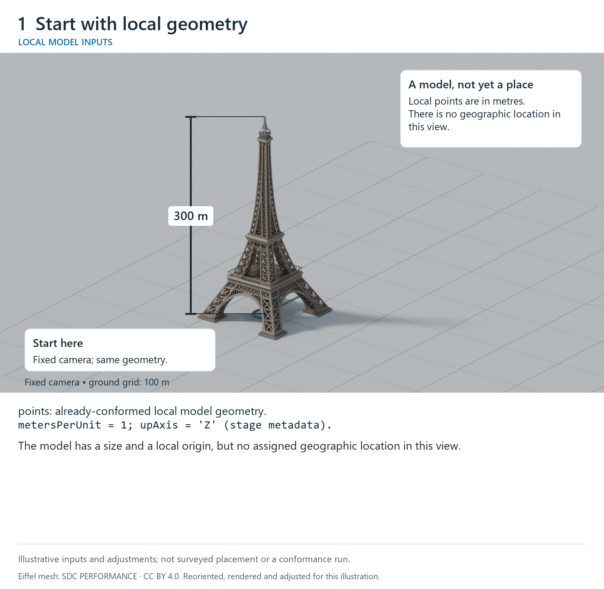
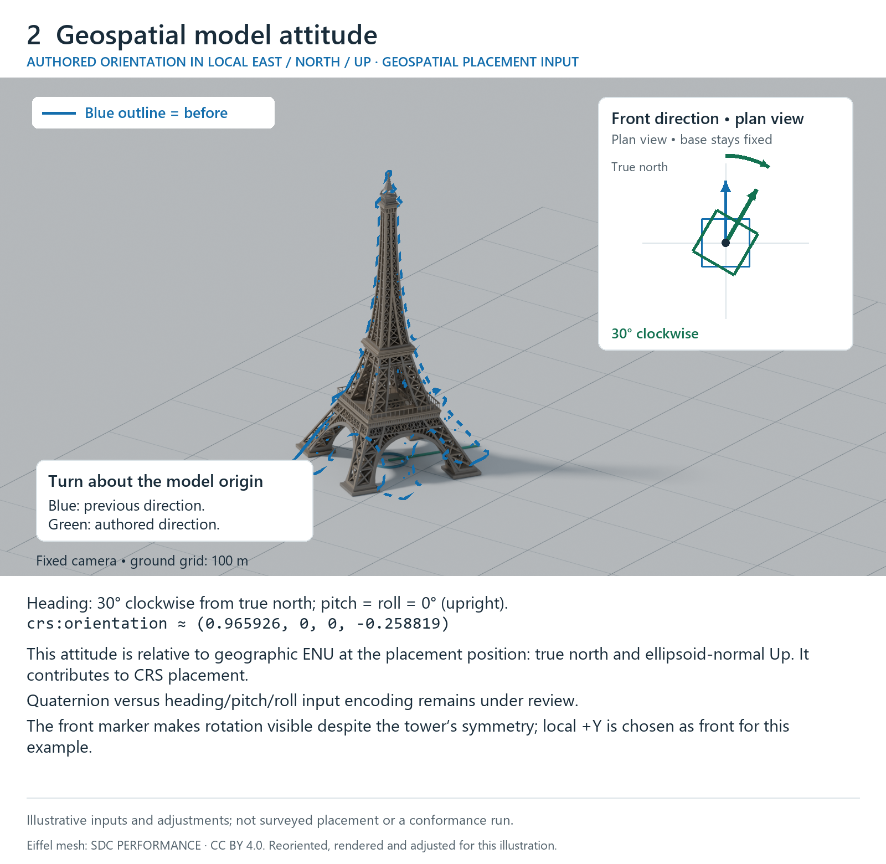
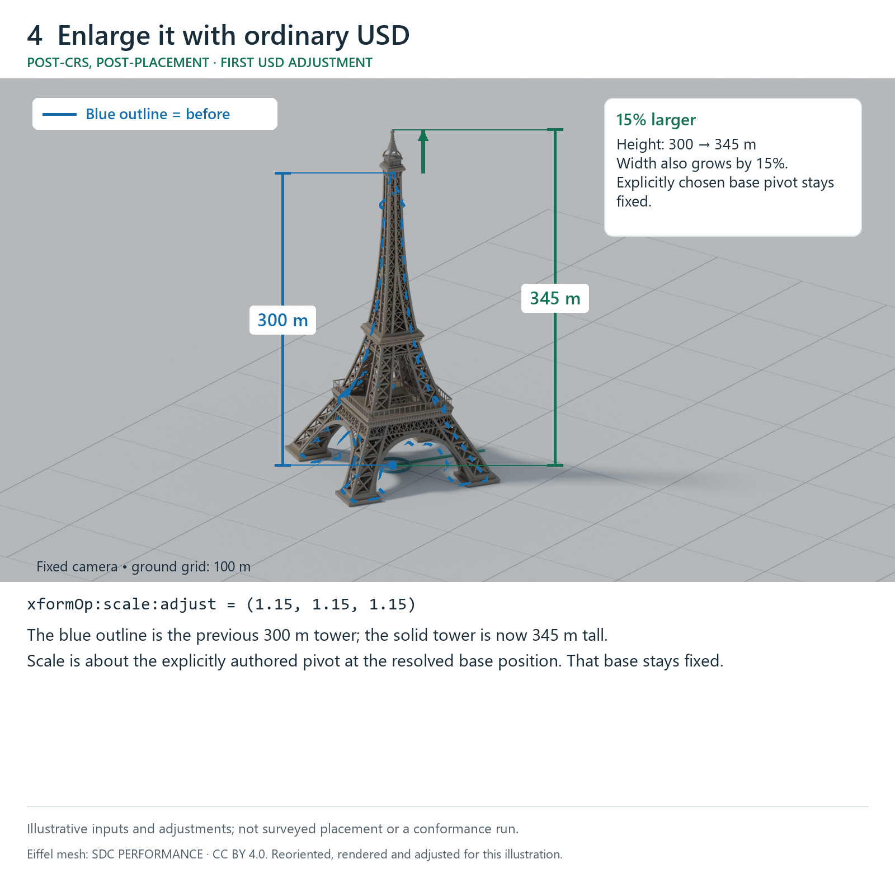
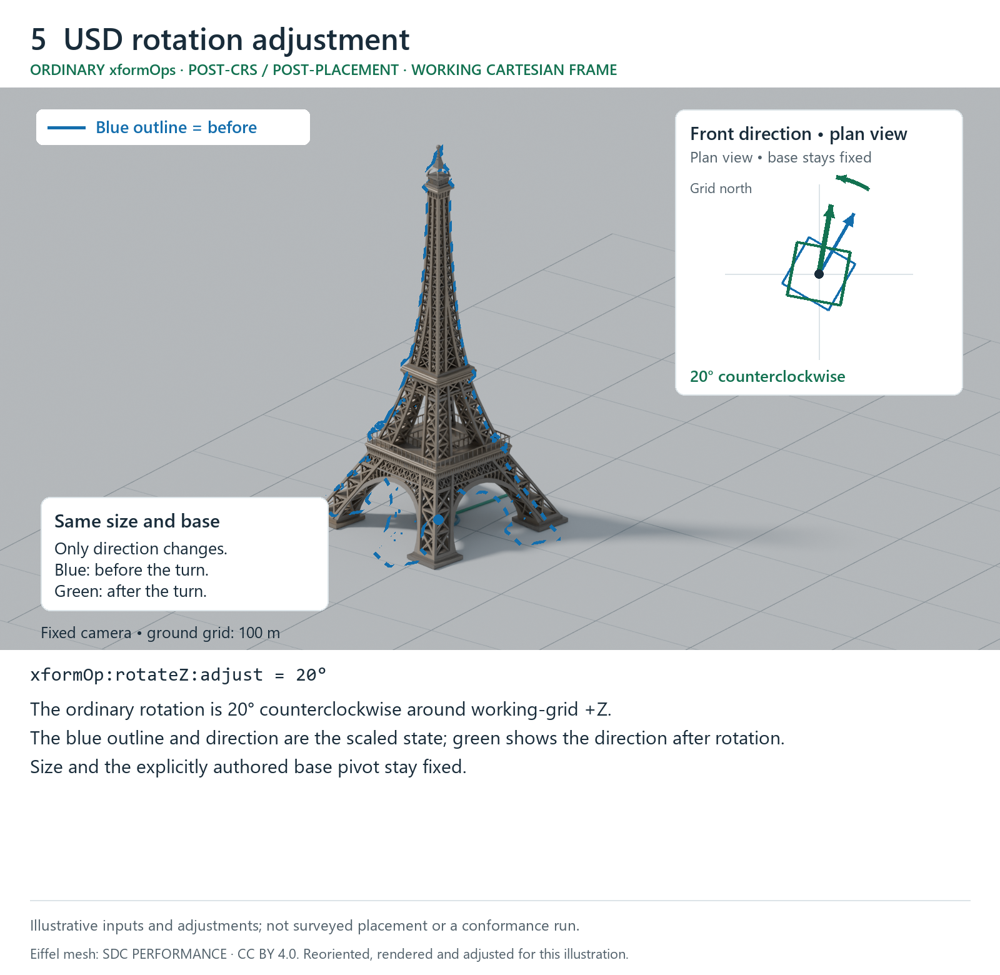

# Geospatial placement and ordinary USD transform order

This informative sequence illustrates the agreed ordering: resolve geospatial
placement, then apply the ordinary USD adjustment. It neither adds computed
placement attributes to the source schema nor settles the attitude input encoding.
All height, attitude and adjustment values are illustrative. The source is one
static RGF93 v2b realization; the requested output is its Lambert-93 projection
with ellipsoidal height. It does not demonstrate a gravity-related height or
coordinate-epoch transformation.

The six snapshots use one camera and one ground grid. In the change panels, a
blue outline shows the previous tower and the solid render shows the current
tower. Plan-view model-front markers make heading changes visible despite the
tower's symmetry. Height guides separate the size change from rotation, and
the final overlay shows the old and new positions together.

For side-by-side review, the sequence is also available as two image strips:
[geospatial inputs and CRS resolution](crs-placement-inputs.png) and
[ordinary USD adjustments after placement](usd-post-placement-adjustments.png).

## Local geometry



The figure begins with local model points already conformed to the stage's metre
and Z-up conventions. No geographic placement is assigned in this view.

## Geospatial model attitude (local geographic frame)



For this geographic-source example, the current candidate's authored
`crs:orientation` quaternion is relative to the local east/north/up basis and
represents a 30-degree clockwise heading, with zero pitch and roll. The displayed
quaternion is rounded; the calculation uses full precision. This is an authored
input, distinct from an orientation computed in a requested output CRS. The
figure does not choose between this encoding and the proposed heading/pitch/roll
input attributes. For this illustration, local +Y is chosen as the model-front
direction; this is not a new default model-front convention.

The terminology connects geospatial and USD descriptions: **model attitude** is
the model's three-dimensional orientation relative to the local geodetic frame;
**heading** is its horizontal direction measured here clockwise from true north.
Heading, pitch and roll describe that attitude, but this upright example varies
only heading. The illustration does not prescribe pitch/roll signs or Euler
rotation order, or decide the stored input representation.

Both geospatial attitude and an ordinary USD rotation can be represented by
quaternions or rotation matrices. Their meaning comes from their reference
frame and evaluation role. In this example, the authored geospatial attitude
orients the model against true north and ellipsoid-normal Up at its placement
position, as an input to geospatial placement. An ordinary xformOp rotation
contributes to the ordered USD adjustment in the working Cartesian context
after CRS placement and resolution. The same numerical quaternion would not
automatically have the same meaning in those two contexts.

For a USD reader, the shown 30-degree heading is a rotation of minus 30 degrees
about local +Up in this right-handed, Z-up ENU example, with model +Y chosen as
front. It contributes to geospatial placement; the later ordinary
`xformOp:rotateZ:adjust` is a separate post-placement adjustment about working-grid
+Z. Their references and roles differ even though both involve rotation.

## CRS placement and resolution


The bound `crs:wkt`, source `crs:position` and model attitude supply geospatial
placement. The requested output context is selected by the consumer. Conversion
is evaluated for the model points; the displayed convergence and projection
scale are local diagnostic results, not a complete finite-extent affine map.
Neither these factors nor the resulting output position is a new `crs:*`
attribute. View-origin subtraction makes large coordinates displayable without
changing the placement.

## Ordinary USD scale



Only scale changes in this snapshot: `xformOp:scale:adjust = (1.15, 1.15, 1.15)`.
The explicitly authored pivot stays fixed and the tower's dimensions grow by
15 percent. The blue outline is the CRS-resolved state, before ordinary scale.

## USD rotation adjustment (working Cartesian frame)



The example's Cartesian working context is the same as its requested output
context, so no working-to-output transport is needed. An ordinary USD pivot is
explicitly authored at the shown resolved position. That fixed, chosen input
avoids selecting a default pivot for question 3; it is not a runtime-maintained
copy of the geospatial position. With row-vector notation and resolved point
`q`, pivot `P`, ordinary scale `S` and ordinary rotation `R`, this contribution
is `(q - P) * S * R + P`. Scale is shown separately above; this snapshot adds
only the 20-degree counterclockwise rotation about working-grid +Z. The blue
outline is the scaled state, before rotation. The base position `P` and the
scaled size stay fixed while direction changes.

## Ordinary USD translation and final result


The translation follows that scale/rotation: `(q - P) * S * R + P + t`.
The final reported position differs from the authored source position because it
includes the ordinary USD adjustment. Rendering and non-visual coordinate
queries must agree on that final placement.

The blue tower outline stays at its previous position while the solid tower
moves. The plan-view arrows break the one translation into east/south components
for illustration; they are not two separately authored USD operations.

The example's stack is listed below in USD's `xformOpOrder` order, from least
local to most local. A point encounters the listed operations in reverse order.
The stack is the post-CRS adjustment; its inverse-pivot operation acts on the
already-resolved point and does not move ordinary USD transforms into the CRS
definition or source placement computation.

```usda
double3 xformOp:translate:adjust = (120, -60, 0)
double3 xformOp:translate:pivot = (648237.3015492002, 6862271.681553578, 80)
double xformOp:rotateZ:adjust = 20
double3 xformOp:scale:adjust = (1.15, 1.15, 1.15)
uniform token[] xformOpOrder = [
    "xformOp:translate:adjust",
    "xformOp:translate:pivot",
    "xformOp:rotateZ:adjust",
    "xformOp:scale:adjust",
    "!invert!xformOp:translate:pivot"
]
```

These conceptual snapshots are contributions to a single evaluation. They do not
require an implementation to expose intermediate prims, write source layers,
offer a specific API or use the rendering tool that produced the illustration.
The sequence does not settle inherited adjustment context, descendant resets or
independently bound instances; those follow their own specified contracts.

## Figure provenance and credit

The tower geometry comes from the existing Eiffel model used in the proposal's
illustrations. This sequence reorients, renders and adjusts it for explanatory
purposes; it is not surveyed Paris ground truth or a proposal conformance run.

“( FREE ) La tour Eiffel” by
[SDC PERFORMANCE](https://sketchfab.com/Lambo_SC04),
[original model](https://sketchfab.com/3d-models/free-la-tour-eiffel-8553f94d06e24cb4b0fde1080f281674),
licensed [CC BY 4.0](https://creativecommons.org/licenses/by/4.0/).
